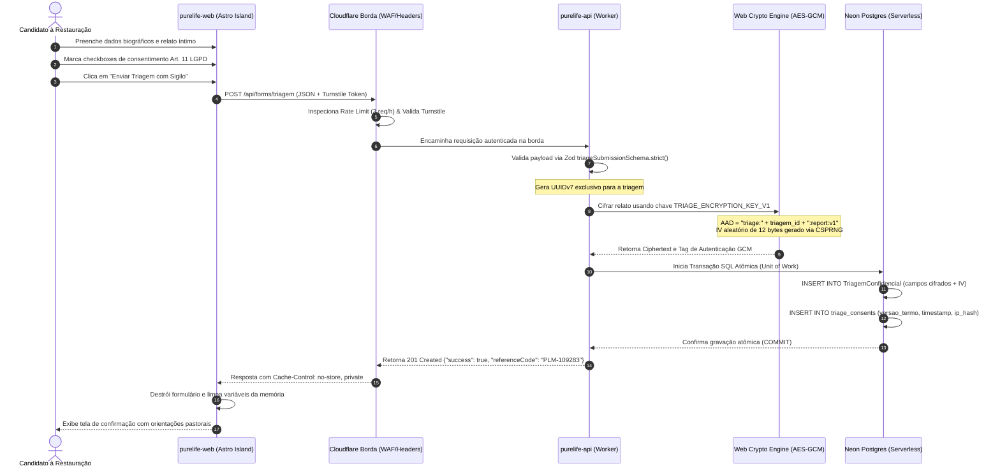
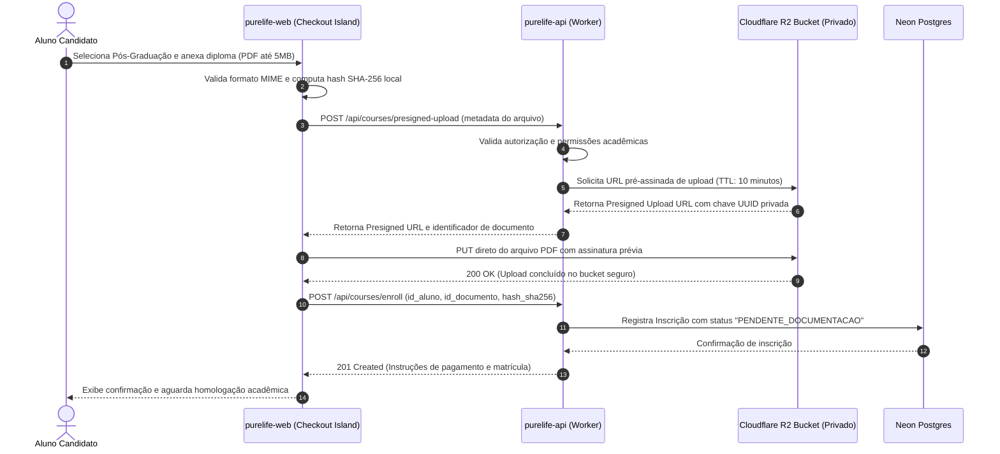
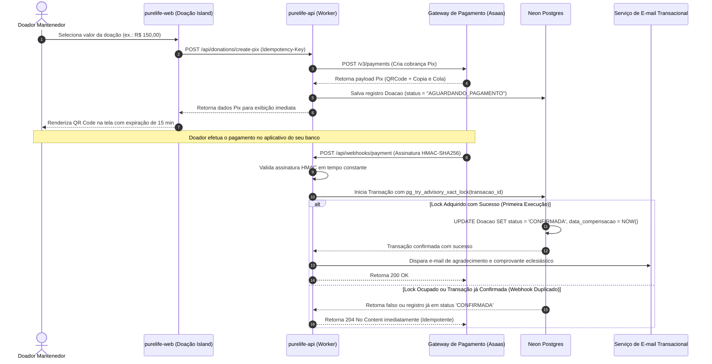
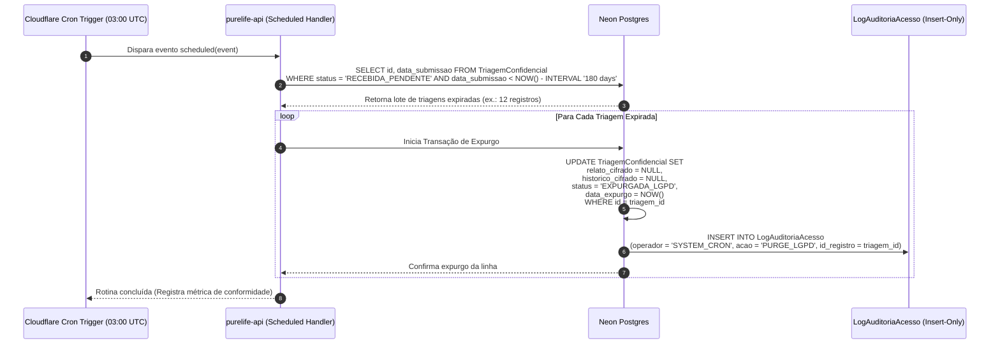

# Diagramas de Sequência e Fluxos Canónicos

**Especificação Visual de Interações entre Subsistemas**  
**Versão:** 1.0.0  
**Classificação:** Arquitetura de Software e Engenharia de Borda  
**Notação:** Mermaid Sequence Diagrams (v10+)

---

## 1. Fluxo 1: Submissão de Triagem Confidencial e Cifra com AAD

O diagrama a seguir descreve a jornada ponta a ponta desde o preenchimento do formulário no navegador do aconselhando até a persistência cifrada em repouso no Neon Postgres, garantindo que o relato confidencial jamais seja gravado em texto plano no banco de dados.

---

## 2. Fluxo 2: Inscrição em Pós-Graduação com Upload Seguro no Cloudflare R2

O processo de envio do diploma de graduação para a pós-graduação utiliza URLs pré-assinadas com controle de acesso privado, impedindo a sobrecarga da API do Worker com tráfego de arquivos pesados.

---

## 3. Fluxo 3: Doação via Pix e Conciliação Idempotente de Webhook

O fluxo a seguir ilustra a geração do Pix dinâmico e o processamento do webhook financeiro com trava de transação atômica (`pg_try_advisory_xact_lock`), evitando processamento duplicado mesmo sob rajadas de requisições idênticas da rede.

---

## 4. Fluxo 4: Rotina Diária Noturna de Expurgo Criptográfico Temporal

Em cumprimento estrito aos princípios da necessidade e da minimização da LGPD (Art. 16, I), uma rotina cron disparada pelo Cloudflare Worker executa a destruição criptográfica irreversível de triagens não convertidas após 180 dias.

