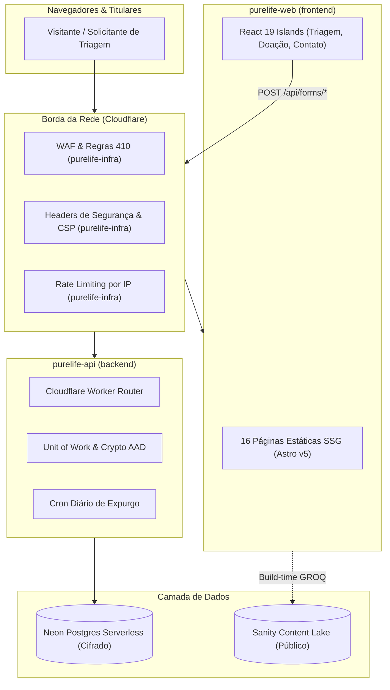

# Visão Geral do Sistema: Arquitetura Multirepo Pure Life Brasil

Documento mestre de arquitetura para a organização [`purelifeministriesbrasil`](https://github.com/purelifeministriesbrasil).

## 1. Topologia de Repositórios

O ecossistema adota uma estrutura multirepo rigorosa onde cada repositório possui limites de responsabilidade, stack tecnológica e ciclo de vida isolados:

| Repositório Git | Nome do Pacote / Sistema | Stack Tecnológica | Hospedagem / Runtime |
|---|---|---|---|
| `frontend` | `purelife-web` | Astro v5, Tailwind CSS v4, React 19 Islands | Cloudflare Pages (SSG 100% estático) |
| `backend` | `purelife-api` | TypeScript, Clean Architecture / DDD, Drizzle ORM | Cloudflare Workers & Neon Postgres |
| `cms` | `purelife-cms` | Sanity Studio v3, React 19, TypeScript | Sanity Cloud & Sanity Content Lake |
| `contracts` | `purelife-contracts` | TypeScript, Zod (`.strict()`) | Pacote compartilhado de tipos e esquemas |
| `documentation` | `purelife-docs` | Markdown, GitHub Pages | GitHub Pages (`purelifeministriesbrasil.github.io`) |
| `infra` | `purelife-infra` | Terraform (HCL), Cloudflare Provider | Infraestrutura de borda (WAF, DNS, 410, Headers) |

## 2. Princípios Inegociáveis de Arquitetura

1. **Astro SSG para Performance e Segurança (ADR-001)**:
   - Toda página editorial pública é gerada como HTML estático no momento do build (`prerender = true`).
   - Orçamento de JavaScript na Home Page $\le$ 8 KB gzip (transferido real de 1.02 kB gzip).
   - Zero dependência de runtime SSR ou Node.js em produção para páginas públicas.

2. **Isolamento Absoluto entre Sanity e Neon (ADR-002)**:
   - **Sanity (`purelife-cms`)**: Restrito exclusivamente a conteúdo público editorial (programas, livros, FAQs, episódios de podcast) e depoimentos com consentimento formal por escrito.
   - **Neon (`purelife-api`)**: Restrito a dados transacionais e confidenciais (submissões de triagem, consentimentos, contatos, intenções de doação e logs de auditoria).
   - Não existe nenhuma integração que envie dados de aconselhamento para o CMS.

3. **Cifra de Campo em Repouso com AAD (ADR-004)**:
   - Todos os dados sensíveis de triagem e relatos pastorais são cifrados com AES-256-GCM via Web Crypto API nativa.
   - AAD no formato `${entityType}:${entityId}:${field}:v${keyVersion}` garante que ciphertexts não possam ser transpostos entre colunas ou registros.

4. **Transação Atómica Triage Unit of Work**:
   - Submissão preliminar, cálculo do UUID para o AAD, cifra dos campos sensíveis e persistência do consentimento com chave estrangeira real ocorrem em um único bloco transacional no Postgres.
