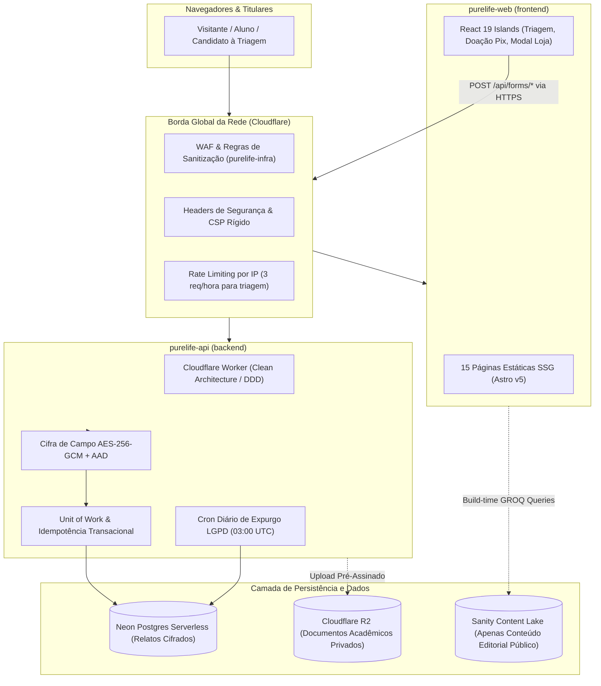

# Visão Geral do Sistema: Arquitetura Multirepo Pure Life Brasil

**Documento Canónico de Arquitetura de Software e Engenharia de Soluções**  
**Versão:** 2.0.0  
**Status:** Aprovado / Em Produção  
**Organização GitHub:** [`purelifeministriesbrasil`](https://github.com/purelifeministriesbrasil)  
**Domínio Canónico:** `purelifeministriesbrasil.org`

---

## 1. Topologia de Repositórios e Governança Multirepo

O ecossistema adota uma estrutura multirepo rigorosa onde cada repositório possui limites estritos de responsabilidade, stack tecnológica e ciclo de vida isolados:

| Repositório Git | Nome do Pacote / Sistema | Stack Tecnológica | Hospedagem / Runtime | Papel Arquitetural |
|---|---|---|---|---|
| `frontend` | `purelife-web` | Astro v5, Tailwind CSS v4, React 19 Islands | Cloudflare Pages (SSG 100% estático) | Apresentação pública, vitrine de cursos, literatura e ilhas interativas. |
| `backend` | `purelife-api` | TypeScript, Clean Architecture / DDD, Drizzle ORM | Cloudflare Workers & Neon Postgres | Regras de negócio, transações ACID, cifra AES-256-GCM e conciliação de pagamentos. |
| `cms` | `purelife-cms` | Sanity Studio v3, React 19, TypeScript | Sanity Cloud & Sanity Content Lake | Gestão de conteúdo editorial público (artigos, vídeos, FAQs e depoimentos autorizados). |
| `contracts` | `purelife-contracts` | TypeScript, Zod (`.strict()`) | Biblioteca TypeScript compartilhada | Fonte única da verdade para esquemas de entrada, DTOs e tipos de domínio. |
| `documentation` | `purelife-docs` | Docsify, GitHub Pages | GitHub Pages nativo via Actions | Portal canónico de documentação, ADRs, runbooks, SRS e guias de engenharia. |
| `infra` | `purelife-infra` | Terraform (HCL), Cloudflare Provider | Infraestrutura como Código (IaC) | Configuração de borda, WAF, DNS, cabeçalhos de segurança HTTP e regras 410 Gone. |



---

## 2. Princípios Inegociáveis de Arquitetura

<!-- tabs:start -->

#### **1. Astro SSG Zero-JS (ADR-001)**

- Toda página editorial pública (institucional, programas, sobre nós, FAQs) é gerada como HTML puro no momento do build (`prerender = true`).
- Orçamento de JavaScript na Home Page $\le$ 8 KB gzip (transferência real observada de 1.02 kB gzip).
- Zero dependência de runtime Node.js ou SSR para páginas públicas na borda.
- Componentes interativos são isolados em ilhas React (`client:visible` ou `client:idle`), preservando a performance global.

#### **2. Isolamento Sanity vs Neon (ADR-002)**

- **Sanity (`purelife-cms`):** Restrito exclusivamente a conteúdo público editorial (programas, livros, FAQs, episódios de podcast) e depoimentos com autorização prévia por escrito.
- **Neon (`purelife-api`):** Restrito a dados transacionais, fiscais e confidenciais (submissões de triagem, consentimentos, matrículas, doações e logs de auditoria).
- **Invariante:** Não existe nenhuma ponte, sincronização ou chamada que envie dados confidenciais de triagem ou PII para o Sanity. O Sanity nunca armazena confissões.

#### **3. Cifra em Repouso AES-256-GCM + AAD (ADR-004)**

- Todos os dados sensíveis de triagem e relatos pastorais são cifrados com AES-256-GCM via Web Crypto API nativa.
- O AAD (*Additional Authenticated Data*) no formato `${entityType}:${entityId}:${field}:v${keyVersion}` garante que ciphertexts não possam ser transpostos entre colunas ou registros sem corromper a autenticação do bloco.

#### **4. Idempotência Financeira Transacional (ADR-005)**

- Toda criação de doação ou recebimento de webhook opera sob o modelo de lease atômico `claimOrResume` utilizando travas de advisory no Postgres (`pg_try_advisory_xact_lock`).
- Previne corridas de concorrência, doações duplicadas ou liberação indevida de matrículas decorrentes de reenvio de webhooks.

<!-- tabs:end -->

---

## 3. Matriz de Qualidade Arquitetural e Objetivos de Nível de Serviço (SLOs)

O sistema é medido continuamente contra os seguintes indicadores de qualidade:

| Métrica Arquitetural | Objetivo de Nível de Serviço (SLO) | Mecanismo de Garantia |
|---|:---:|---|
| **First Contentful Paint (FCP)** | $\le 1{,}0\text{ segundo}$ (P95) | Astro SSG distribuído em mais de 300 pontos de presença Cloudflare. |
| **Time to First Byte (TTFB)** | $\le 200\text{ milissegundos}$ | Cache de borda global sem execução de funções de servidor para HTML. |
| **Cumulative Layout Shift (CLS)** | $\le 0{,}05$ | Imagens com dimensões explícitas e ausência de injeção dinâmica de banners. |
| **Disponibilidade da Borda (CDN)** | $\ge 99{,}9\%$ mensal | Infraestrutura resiliente da Cloudflare sem SPOF (Single Point of Failure). |
| **Disponibilidade da Ingestão (API)** | $\ge 99{,}95\%$ mensal | Cloudflare Workers Serverless distribuídos com isolamento V8. |
| **RPO (Recovery Point Objective)** | $\le 1\text{ hora}$ | Backups contínuos via WAL e Point-in-time recovery do Neon Postgres. |
| **RTO (Recovery Time Objective)** | $\le 1\text{ hora}$ | Provisionamento automatizado de infraestrutura via Terraform (IaC). |

---

## 4. Estrutura de Clean Architecture / DDD no Backend (`purelife-api`)

O Cloudflare Worker foi desenhado respeitando os círculos concêntricos da **Clean Architecture**:

```text
backend/src/
├── domain/            # Entidades puras, regras de negócio e contratos de repositório
│   ├── entities/      # Triage, Donation, CourseEnrollment, User
│   └── value-objects/ # Email, CPF, AADContext, SensitiveReport
├── application/       # Casos de uso da aplicação
│   ├── use-cases/     # SubmitTriageUseCase, ProcessPixDonationUseCase, PurgeExpiredTriageUseCase
│   └── ports/         # CryptoPort, StoragePort, PaymentGatewayPort, NotificationPort
├── infrastructure/    # Implementações técnicas e adaptadores externos
│   ├── crypto/        # WebCryptoEngine (AES-256-GCM com AAD)
│   ├── database/      # Drizzle ORM Schema, Neon Client, UnitOfWork
│   └── gateways/      # AsaasPaymentAdapter, CloudflareR2StorageAdapter
└── presentation/      # Borda HTTP e Handlers
    ├── middleware/    # RequestGuard, RateLimiter, ErrorHandler, AuthMiddleware
    └── routes/        # Router modular (/api/forms/*, /api/donations/*, /api/webhooks/*)
```
