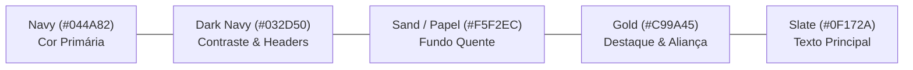

# Design System & Guia de Estilo e Tom de Voz

**Especificação Visual e Diretrizes de Comunicação Institucional**  
**Versão:** 1.0.0  
**Classificação:** Padrão Canónico de UI/UX e Conteúdo  
**Público-Alvo:** Desenvolvedores Frontend, Designers de Produto e Redatores Pastorais

---

## 1. Princípios Fundamentais de Design

O ecossistema digital da **Pure Life Ministries Brasil** lida com indivíduos e casais em momentos de vulnerabilidade existencial, dor emocional provocada por infidelidade conjugal e luta espiritual contra compulsões sexuais. O design visual e a experiência do usuário não devem se assemelhar a uma plataforma comercial comum nem a uma rede social engajadora de cliques.

Os quatro pilares orientadores são:

1. **Sobriedade e Reverência:** Interfaces limpas, silenciosas e sem distrações visuais excessivas. O acolhimento é priorizado sobre o marketing visual espalhafatoso.
2. **Dignidade e Respeito:** Cores e tipografias que transmitam acolhimento maduro, seriedade institucional e fé cristã bíblica sólida.
3. **Segurança Psicológica Visível:** Cada interação que envolva coleta de informações pessoais deve explicitar claramente o sigilo pastoral, a criptografia e o respeito à privacidade (LGPD).
4. **Zero Emojis e Iconografia Limpa:** Não são permitidos emojis em interfaces oficiais ou documentos técnicos. Toda comunicação visual utiliza ícones geométricos vetorizados da biblioteca `lucide-react`.

---

## 2. Paleta de Cores Canónica (Tokens CSS Tailwind v4)

As cores institucionais foram concebidas para garantir conformidade estrita com o padrão **WCAG 2.1 nível AAA** para contraste e legibilidade.



### Especificação Técnica dos Tokens

| Token de Cor | Hexadecimal | RGB | Aplicação de UI | Contraste (WCAG) |
|---|:---:|:---:|---|:---:|
| `color-primary` | `#044A82` | `rgb(4, 74, 130)` | Botões de ação primária, cabeçalhos de destaque, links e bordas ativas. | `8.2:1` sobre branco |
| `color-primary-dark` | `#032D50` | `rgb(3, 45, 80)` | Barras de navegação, rodapé institucional e backgrounds de alta autoridade. | `12.5:1` sobre branco |
| `color-sand` | `#F5F2EC` | `rgb(245, 242, 236)` | Backgrounds de cartões de acolhimento, barras laterais e áreas de leitura prolongada. | `1.1:1` (superfície) |
| `color-sand-light` | `#FAF8F5` | `rgb(250, 248, 245)` | Fundo geral da página para evitar fadiga ocular em fundos brancos puros. | `1.05:1` (superfície) |
| `color-accent-gold` | `#C99A45` | `rgb(201, 154, 69)` | Badges de destaque, datas de início de programas e marcadores de aliança matrimonial. | `4.6:1` sobre escuro |
| `color-text-main` | `#0F172A` | `rgb(15, 23, 42)` | Texto corrido principal e títulos de alta hierarquia. | `15.8:1` sobre `#FAF8F5` |
| `color-text-muted` | `#475569` | `rgb(71, 85, 105)` | Textos secundários, legendas de formulários e metadados. | `6.1:1` sobre `#FAF8F5` |
| `color-success` | `#059669` | `rgb(5, 150, 105)` | Confirmações de pagamento, status de triagem recebida e badges de conformidade. | `4.8:1` sobre branco |
| `color-danger` | `#DC2626` | `rgb(220, 38, 38)` | Erros de validação, bloqueios de segurança e alertas de maioridade civil. | `5.2:1` sobre branco |

---

## 3. Tipografia Editorial e Hierarquia

A composição tipográfica equilibra a legibilidade do texto na web com a elegância de publicações impressas cristãs:

- **Fonte de Títulos (Headings):** Família Serifada Clássica (`Newsreader`, `Playfair Display` ou `Georgia`) aplicada em títulos principais (`h1`, `h2`) nas páginas institucionais, transmitindo profundidade bíblica e tradição histórica.
- **Fonte de Leitura e Interface (Body & UI):** Família Sans-Serif Moderna (`Inter`, `system-ui`) aplicada em corpo de texto, botões, formulários e tabelas para clareza absoluta e legibilidade em qualquer dispositivo.
- **Fonte Monospaçada (Code & Hashes):** Família Monospaçada (`JetBrains Mono`, `ui-monospace`) aplicada em códigos de autenticação de certificados, chaves Pix e trechos de comandos técnicos.

### Escala de Espaçamento e Tipos

```css
/* Tokens de Tipografia */
--text-h1: clamp(2.0rem, 4vw, 2.75rem); /* Título Principal */
--text-h2: clamp(1.5rem, 3vw, 2.0rem);  /* Seções de Domínio */
--text-h3: 1.25rem;                     /* Subtítulos de Cartões */
--text-body: 1.0rem;                    /* Leitura Padrão (line-height: 1.65) */
--text-small: 0.875rem;                 /* Informações Legais e Notas LGPD */
--text-caption: 0.75rem;                /* Badges de Versão e Timestamps */
```

---

## 4. Biblioteca de Ícones e Estilo Visual

Toda a iconografia do projeto utiliza com exclusividade o pacote [`lucide-react`](https://lucide.dev/):

- **Espessura de Traço (Stroke Width):** Fixada em `1.5px` ou `2.0px`.
- **Dimensões Padronizadas:**
  - Micro-interações em botões: `16x16px` (`w-4 h-4`).
  - Itens de lista e menus: `20x20px` (`w-5 h-5`).
  - Cabeçalhos de cartões funcionais: `28x28px` (`w-7 h-7`).
- **Mapeamento de Ícones por Domínio:**
  - *Aconselhamento e Triagem:* `ShieldCheck`, `Lock`, `FileHeart`, `HeartHandshake`.
  - *Educação e Cursos:* `GraduationCap`, `BookOpen`, `Award`, `FileText`.
  - *Doações e Loja:* `CreditCard`, `QrCode`, `ShoppingBag`, `Receipt`.
  - *Navegação e Sistema:* `ArrowRight`, `CheckCircle2`, `AlertCircle`, `ExternalLink`.

---

## 5. Diretrizes de Tom de Voz e Comunicação Institucional

Ao redigir textos para o portal, formulários de triagem ou mensagens transacionais, adote as seguintes orientações canónicas:

<!-- tabs:start -->

#### **Como Comunicar**

- **Clareza Bíblica sem Acusações:** Reconheça a gravidade do pecado e da infidelidade conjugal com a mesma gravidade das Escrituras, mas aponte imediatamente para o poder perdoador e transformador do Evangelho de Cristo.
- **Garantia de Sigilo Explícita:** Sempre que um formulário solicitar informações sobre a vida íntima, declare no rodapé imediato: *"Seu relato é confidencial, protegido por sigilo pastoral e criptografia ponta a ponta"*.
- **Precisão Financeira:** Indique claramente valores, prazos e custos sem letras miúdas ou renovações automáticas ocultas.

#### **O que Evitar**

- **Nunca use Emojis:** Não utilize emojis em botões, títulos, alertas ou rodapés. Substitua-os por ícones do `lucide-react` ou tags textuais sóbrias como `[IMPORTANTE]`, `[SIGILO]`, `[LGPD]`.
- **Evite Sensacionalismo:** Não utilize chamadas apelativas como *"Descubra o segredo do seu marido"* ou gatilhos de escassez artificial como *"Últimas 2 vagas antes que acabe"*.
- **Sem Falsas Promessas:** Aconselhamento bíblico exige arrependimento genuíno e perseverança. Evite promessas de "cura rápida em 3 passos".

<!-- tabs:end -->
