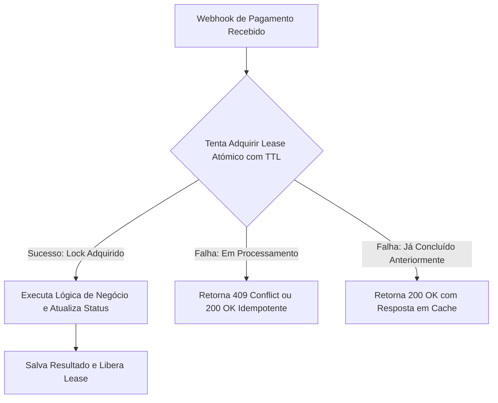

# ADR-005: Modelo de Lease Atómico para Idempotência de Webhooks

- **Status**: Aprovado
- **Data**: 2026-09-24
- **Decisores**: Equipe de Engenharia Pure Life Ministries Brasil

---

## 1. Contexto e Motivação

Gateways de pagamento (como Asaas e Mercado Pago) utilizam retentativas automáticas (*at-least-once delivery*) no envio de webhooks de notificação de PIX e cartão. Em caso de instabilidade transitória de rede ou lentidão temporária, a mesma notificação de confirmação de pagamento pode chegar em duplicidade ou em paralelo simultâneo à API.

A ausência de tratamento de concorrência estrita pode provocar:

1. Confirmações duplicadas de doações.
2. Disparo duplicado de recibos fiscais ou e-mails de agradecimento.
3. Condições de corrida (*race conditions*) corrompendo o saldo e status financeiro.

---

## 2. Decisão

Adotar o **Padrão de Lease Atómico de Idempotência** no processamento de webhooks financeiros:

### Regras do Mecanismo:
1. **Identificador Canónico**: Baseado no `id` único do evento ou chave de idempotência fornecida pelo gateway.
2. **Lease com TTL (Time-To-Live)**: O lock expira automaticamente em 120 segundos caso o worker falhe catastroficamente durante a execução, evitando deadlocks permanentes.
3. **Persistência do Resultado**: Após a conclusão bem-sucedida, a resposta de sucesso é armazenada para responder requisições repetidas sem reprocessar a lógica de negócio.

---

## 3. Consequências

### Impactos Positivos:
- **Segurança Transacional**: Zero risco de processamento duplicado de ofertas ou doações.
- **Resiliência a Retentativas**: O sistema responde com sucesso imediato caso o gateway reenvie a mesma notificação após confirmação.
