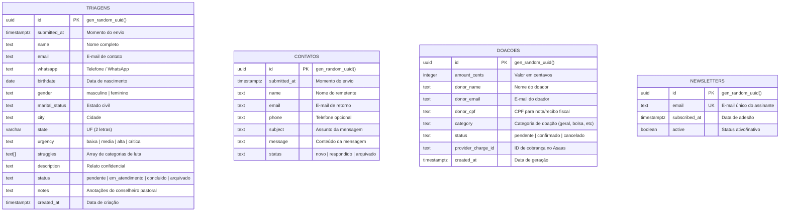

# Modelo de Dados Relacional (Supabase Postgres)

A persistência do ecossistema é centralizada no PostgreSQL gerenciado pelo **Supabase**, organizado em tabelas estritamente tipadas, com chaves primárias UUID e políticas ativas de Row Level Security (RLS).

---

## 1. Diagrama Entidade-Relacionamento (ERD)

---

## 2. Detalhamento das Tabelas

### A. Tabela `triagens`
Armazena as requisições de aconselhamento bíblico pastoral e admissão no programa residencial. Trata-se da tabela mais crítica do sistema sob a ótica da LGPD.

| Coluna | Tipo | Restrições | Descrição |
| :--- | :--- | :--- | :--- |
| `id` | `UUID` | `PRIMARY KEY, DEFAULT gen_random_uuid()` | Identificador único e não previsível |
| `submitted_at` | `TIMESTAMPTZ` | `NOT NULL, DEFAULT now()` | Carimbo de data/hora do envio |
| `name` | `TEXT` | `NOT NULL` | Nome completo do assistido |
| `email` | `TEXT` | `NOT NULL` | E-mail para contato e agendamento |
| `whatsapp` | `TEXT` | `NOT NULL` | Número de telefone/WhatsApp com DDD |
| `birthdate` | `DATE` | `NOT NULL` | Data de nascimento (maioridade) |
| `gender` | `TEXT` | `CHECK IN ('masculino', 'feminino')` | Gênero conforme escopo ministerial |
| `marital_status` | `TEXT` | `NOT NULL` | Solteiro, Casado, Noivo, etc. |
| `city` / `state` | `TEXT` / `VARCHAR(2)` | `NOT NULL` | Localização para encaminhamento regional |
| `urgency` | `TEXT` | `CHECK IN ('baixa', 'media', 'alta', 'critica')` | Nível de urgência da situação |
| `struggles` | `TEXT[]` | `NOT NULL, DEFAULT '{}'` | Áreas de luta (pornografia, infidelidade, etc.) |
| `description` | `TEXT` | `NOT NULL` | Relato livre preenchido pelo assistido |
| `status` | `TEXT` | `CHECK IN ('pendente', 'em_atendimento', ...)` | Status do atendimento no fluxo pastoral |
| `notes` | `TEXT` | `NULLABLE` | Anotações confidenciais do conselheiro |

### B. Tabela `contatos`
Mensagens institucionais e dúvidas gerais enviadas pela página de contato.

### C. Tabela `doacoes`
Registro de intenções de oferta e doações PIX, controlando conciliação com o gateway financeiro.

### D. Tabela `newsletters`
Cadastros de e-mail com garantia de unicidade (`UNIQUE`), respeitando a vontade do titular quanto ao opt-out.

---

## 3. Matriz de Permissões e Segurança de Linha (RLS)

| Tabela | Função / Papel | Permissão | Política / Filtro |
| :--- | :--- | :--- | :--- |
| `triagens` | `anon` (Público) | `INSERT` | Permitido com validação de dados |
| `triagens` | `anon` (Público) | `SELECT`, `UPDATE`, `DELETE` | **NEGADO (Zero Leitura Externa)** |
| `triagens` | `authenticated` (Pastoral) | `SELECT`, `UPDATE` | Total para usuários autenticados no painel |
| `contatos` | `anon` (Público) | `INSERT` | Permitido |
| `doacoes` | `anon` (Público) | `INSERT` | Permitido |
| `newsletters` | `anon` (Público) | `INSERT` | Permitido |
