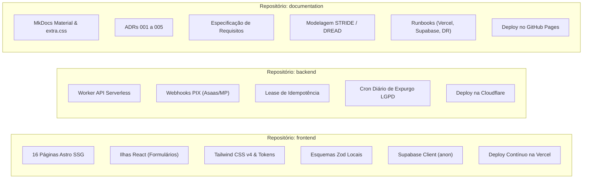

# Divisão Canônica dos Repositórios (Fronteiras e Responsabilidades)

Para assegurar manutenibilidade, isolamento de segurança e clareza de escopo, o ecossistema digital da **Pure Life Ministries Brasil** é estritamente particionado em **três repositórios especializados**, sob a regra canônica:

> **"Front com Front, Back com Back e Docs com Docs."**

---

## 1. Matriz de Responsabilidades

---

## 2. Detalhamento por Repositório

### A. Repositório `frontend` (Front com Front)

Este repositório é dedicado exclusivamente à experiência do usuário final, interface visual e submissão direta e segura de formulários.

* **O que DEVE estar neste repositório:**
  - Todas as 16 rotas estáticas do portal compiladas com Astro 5 (`src/pages/*.astro`).
  - Componentes de UI e layout (`src/components/layout/Header.astro`, `Footer.astro`, `Navigation.astro`).
  - Formulários interativos com Ilhas React (`TriageForm.tsx`, `ContactForm.tsx`, `DonationForm.tsx`, `NewsletterForm.astro`).
  - Estilização completa e tokens em Tailwind CSS v4 (`src/styles/global.css`, `tokens.css`, `fonts.css`).
  - Esquemas de validação de dados em TypeScript com Zod (`src/schemas/`), totalmente desacoplados de pacotes externos.
  - Conexão segura com o Supabase utilizando exclusivamente a chave pública `anon` (`src/lib/supabase.ts`).
  - Assets estáticos institucionais (`public/images/`, `public/fonts/`, `public/favicon.*`).
  - Configuração de cabeçalhos de segurança e cache da Vercel (`vercel.json`).
  - Scripts automatizados de verificação de qualidade (`scripts/verify-topology.mjs` e `scripts/verify-no-inline-style.mjs`).

* **O que NÃO DEVE estar no `frontend`:**
  - Chaves com privilégio administrativo (`service_role` do Supabase ou chaves privadas do gateway de pagamento).
  - Rotinas pesadas de servidor, webhooks de conciliação bancária ou cron jobs de expurgo.
  - Documentação arquitetural extensa ou registros de decisões (ADRs).

---

### B. Repositório `backend` (Back com Back)

Este repositório abriga os serviços em segundo plano, integrações financeiras e operações agendadas que exigem execução protegida do lado do servidor.

* **O que DEVE estar neste repositório:**
  - Funções de servidor e webhooks executados em Cloudflare Workers (`src/index.ts`).
  - Integração com gateways de pagamento (geração de cobranças PIX dinâmicas com Asaas e Mercado Pago).
  - Tratamento de webhooks de pagamento com validação de assinatura criptográfica HMAC-SHA256.
  - Mecanismo de lease de idempotência atômica para impedir processamento duplicado de transações.
  - Tarefa agendada (Cron Trigger `0 3 * * *`) que executa a limpeza de triagens inativas há mais de 180 dias (Conformidade LGPD).
  - Testes automatizados de AppSec e regras de negócio (`test/`).
  - Arquivo de configuração do Worker (`wrangler.toml`).

* **O que NÃO DEVE estar no `backend`:**
  - Páginas HTML, componentes de interface gráfica ou folhas de estilo CSS.
  - Lógica de apresentação de páginas ou manipulação de DOM do navegador.

---

### C. Repositório `documentation` (Docs com Docs)

Este repositório é a fonte canônica da verdade para engenharia, requisitos de negócio, conformidade legal e procedimentos operacionais.

* **O que DEVE estar neste repositório:**
  - Portal estático compilado com **MkDocs Material** (`mkdocs.yml`, `requirements.txt`).
  - Registros de Decisões de Arquitetura (**ADRs 001 a 005**) detalhando cada escolha técnica.
  - Especificação Formal de Requisitos de Software (**SRS**) e Regras de Negócio (**RNs**).
  - Modelagem de Ameaças (**STRIDE / DREAD**) e Documento de Conformidade com a **LGPD (Art. 11)**.
  - Esquemas de Contratos e Validação de Dados.
  - Runbooks Operacionais (Deploy na Vercel, Configuração e Hardening do Supabase, Backup, Rotação de Chaves e CLI Cheatsheet).
  - Governança do Código Aberto (Código de Conduta, Guia de Contribuição, Política de Segurança e Licença MIT).
  - Pipeline de publicação automatizada no GitHub Pages (`.github/workflows/deploy-pages.yml`).

* **O que NÃO DEVE estar no `documentation`:**
  - Código de aplicação em tempo de execução ou dependências npm da aplicação web.
  - Segredos reais, senhas de banco ou chaves de API em produção.
