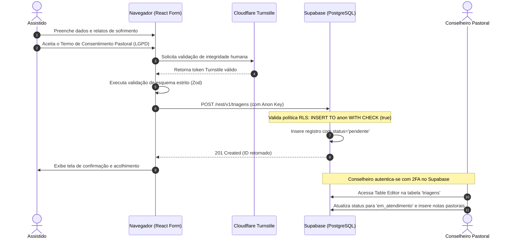
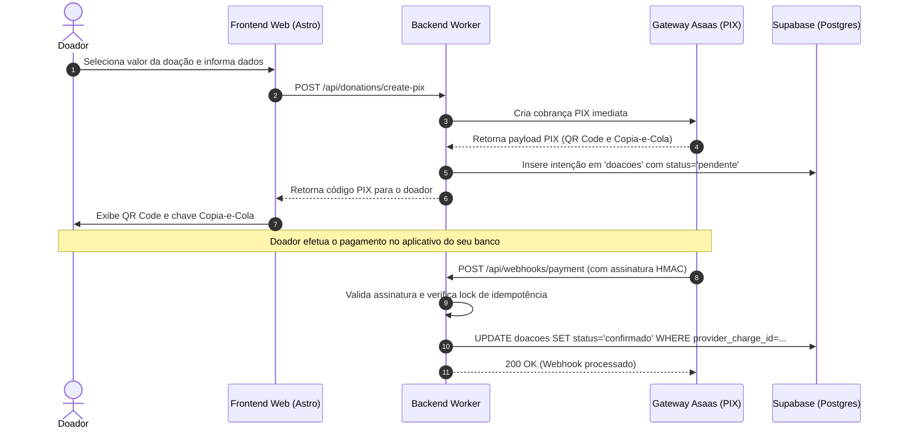
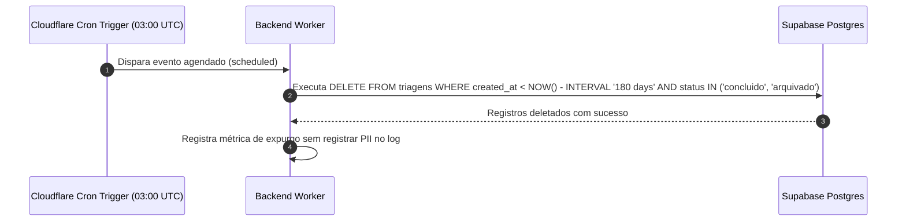

# Diagramas de Sequência Canónicos

Esta seção detalha os principais fluxos operacionais e transacionais do sistema utilizando diagramas de sequência Mermaid.

---

## 1. Fluxo de Submissão de Triagem Confidencial

Este fluxo descreve como um assistido envia o formulário confidencial de triagem até a persistência segura no Supabase e a notificação pastoral.

---

## 2. Fluxo de Criação e Confirmação de Doação PIX

Este fluxo ilustra a geração do código PIX Copia-e-Cola e a conciliação assíncrona com tratamento de idempotência via webhook.

---

## 3. Fluxo de Expurgo Automático LGPD (Retenção Máxima)

Conforme a Política de Retenção e o Artigo 11 da LGPD, registros de triagem arquivados ou pendentes que ultrapassam a janela de retenção de 180 dias são purgados permanentemente.

