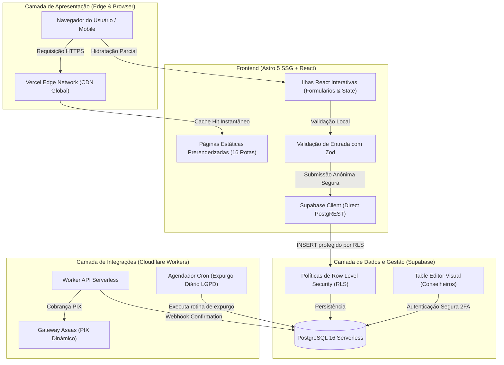

# Visão Geral do Sistema e Arquitetura

O sistema Pure Life Ministries Brasil adota uma arquitetura orientada a serviços leves, com separação rígida entre a camada de apresentação de altíssima velocidade e a camada de persistência confidencial.

---

## 1. Topologia do Sistema

---

## 2. Componentes Principais

### A. Frontend Web (`frontend`)
- **Framework**: Astro 5 configurado com `output: 'static'`.
- **Estilização**: Tailwind CSS v4 com tokens unificados na folha global. Zero CSS inline para compliance estrito com Content Security Policy (`style-src 'self'`).
- **Validação**: Esquemas de validação unificados em `src/schemas/`, sem dependências externas frágeis de pacotes npm locais.
- **Formulários Interativos**:
  - `TriageForm.tsx`: Triagem confidencial com consentimento de sigilo pastoral.
  - `ContactForm.tsx`: Formulário de contato institucional.
  - `DonationForm.tsx`: Intenção de doação com suporte a PIX.
  - `NewsletterForm.astro`: Captação simplificada de informativos por e-mail.

### B. Plataforma de Dados (`Supabase`)
- **Segurança de Linha (RLS)**: Cada tabela possui políticas estritas com validação em nível de banco para garantir preenchimento de campos obrigatórios (sem expressões permissivas de `WITH CHECK (true)`).
- **Sem Exposição de Leitura**: Usuários públicos anônimos só possuem permissão de inserção. É matematicamente impossível consultar dados de terceiros pela API anônima.
- **Painel Visual**: A equipe pastoral utiliza o painel administrativo com controle de acesso granular e auditoria para despachar atendimentos.

### C. Worker de Pagamento e Expurgo (`backend`)
- **Idempotência**: Processamento seguro de webhooks bancários com verificação de assinatura criptográfica.
- **Expurgo Automático**: Tarefa agendada (`0 3 * * *` - 3h da manhã) que limpa registros temporários ou triagens expiradas conforme a política da LGPD.
