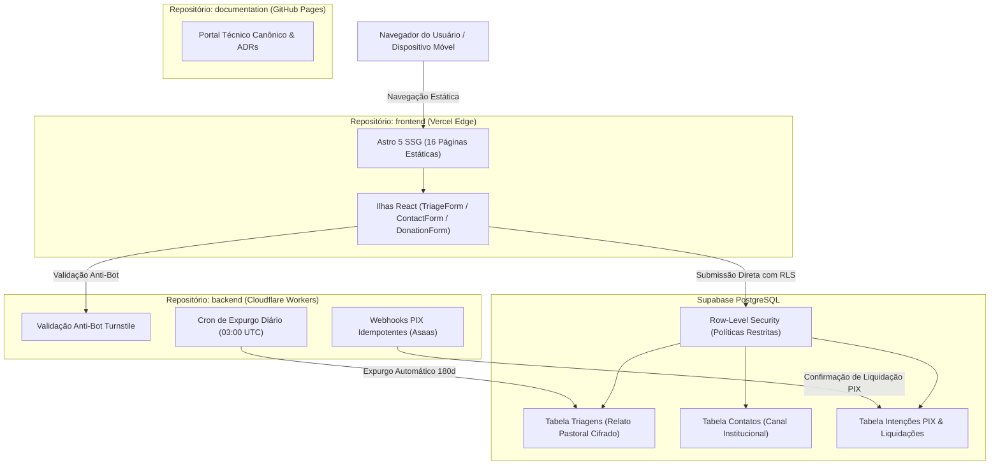

  

    DOCUMENTAÇÃO DE ENGENHARIA
  

  
  <h1 class="docs-hero-title">
    Pure Life Ministries Brasil 
    Plataforma Digital &amp; Guia do Desenvolvedor
  </h1>
  
  

    O ecossistema digital da Pure Life Ministries Brasil apoia a missão de restauração espiritual e aconselhamento bíblico de homens, esposas e famílias. Esta documentação foi feita por e para desenvolvedores: reúne a arquitetura, contratos de dados, runbooks operacionais e decisões técnicas do portal institucional, do sistema confidencial de triagem pastoral (LGPD Art. 11) e da emissão de doações PIX.
  

  

    <a href="getting-started/quickstart/" class="md-button md-button--primary">Como Rodar Localmente</a>
    <a href="architecture/system-overview/" class="md-button">Visão Geral da Arquitetura</a>
    <a href="schemas/triage-schema/" class="md-button">Contratos &amp; Schemas</a>
    <a href="security/crypto-architecture/" class="md-button">Segurança &amp; Criptografia</a>
  

---

## Início Rápido para Desenvolvedores

O ecossistema opera sob três repositórios independentes. Cada projeto possui seu próprio ciclo de desenvolvimento, testes e esteira de CI:

| Repositório | Papel no Ecossistema | Stack Principal | Porta Local | Como Iniciar |
| :--- | :--- | :--- | :--- | :--- |
| **[`frontend`](https://github.com/purelifeministriesbrasil/frontend)** | Portal público, páginas institucionais e ilhas de formulários | Astro 5 SSG, Tailwind v4, React 19, Supabase Client | `localhost:4321` | `pnpm dev` |
| **[`backend`](https://github.com/purelifeministriesbrasil/backend)** | Webhooks PIX, rotinas de expurgo LGPD e API de borda | Cloudflare Worker, Clean Architecture, Supabase Postgres | `localhost:8787` | `pnpm dev` |
| **[`documentation`](https://github.com/purelifeministriesbrasil/documentation)** | Especificações técnicas, contratos, ADRs e runbooks | Material for MkDocs, PyMdown Extensions, Mermaid | `localhost:8000` | `uv run --with-requirements requirements.txt mkdocs serve` |

> Para o passo a passo detalhado de variáveis de ambiente, dependências e setup de banco, consulte o [Guia de Início Rápido (Quickstart)](getting-started/quickstart.md).

---

## Recursos Técnicos Essenciais

  

    

      

        <svg class="tech-icon" viewBox="0 0 24 24" fill="none" stroke="currentColor" stroke-width="2" stroke-linecap="round" stroke-linejoin="round" aria-hidden="true"><path d="M14 2H6a2 2 0 0 0-2 2v16a2 2 0 0 0 2 2h12a2 2 0 0 0 2-2V8z"></path><polyline points="14 2 14 8 20 8"></polyline><line x1="16" y1="13" x2="8" y2="13"></line><line x1="16" y1="17" x2="8" y2="17"></line></svg>
        Decisões Técnicas (ADRs)
      

      

        Fundamentação e trade-offs das escolhas de engenharia: Astro SSG, Supabase Postgres, Vercel Edge, Criptografia AES-GCM e Idempotência.
      

    

    <a href="adrs/index.md" class="four-card-link">
      Consultar ADRs &rarr;
    </a>
  

  

    

      

        <svg class="tech-icon" viewBox="0 0 24 24" fill="none" stroke="currentColor" stroke-width="2" stroke-linecap="round" stroke-linejoin="round" aria-hidden="true"><path d="M12 22s8-4 8-10V5l-8-3-8 3v7c0 6 8 10 8 10z"></path><path d="m9 12 2 2 4-4"></path></svg>
        Sigilo Pastoral &amp; LGPD
      

      

        Criptografia AES-256-GCM com AAD para relatos confidenciais, controle de acesso RLS, proteção Turnstile e testes sentinela de vazamento.
      

    

    <a href="security/threat-model/" class="four-card-link">
      Acessar Segurança &rarr;
    </a>
  

  

    

      

        <svg class="tech-icon" viewBox="0 0 24 24" fill="none" stroke="currentColor" stroke-width="2" stroke-linecap="round" stroke-linejoin="round" aria-hidden="true"><path d="M21 16V8a2 2 0 0 0-1-1.73l-7-4a2 2 0 0 0-2 0l-7 4A2 2 0 0 0 3 8v8a2 2 0 0 0 1 1.73l7 4a2 2 0 0 0 2 0l7-4A2 2 0 0 0 21 16z"></path><polyline points="3.27 6.96 12 12.01 20.73 6.96"></polyline><line x1="12" y1="22.08" x2="12" y2="12"></line></svg>
        Contratos de Dados (Zod)
      

      

        Esquemas TypeScript/Zod para validação rigorosa de formulários de triagem, contato institucional, intenções PIX e payloads de webhook.
      

    

    <a href="schemas/triage-schema/" class="four-card-link">
      Ver Contratos &rarr;
    </a>
  

  

    

      

        <svg class="tech-icon" viewBox="0 0 24 24" fill="none" stroke="currentColor" stroke-width="2" stroke-linecap="round" stroke-linejoin="round" aria-hidden="true"><rect width="20" height="14" x="2" y="3" rx="2"></rect><line x1="8" x2="16" y1="21" y2="21"></line><line x1="12" x2="12" y1="17" y2="21"></line></svg>
        Operações &amp; Runbooks
      

      

        Procedimentos de deploy na Vercel e Cloudflare, monitoramento de liveness e métricas, rotação de chaves e cheatsheet de comandos úteis.
      

    

    <a href="operations/observability/" class="four-card-link">
      Ver Runbooks &rarr;
    </a>
  

---

## Separação Canônica dos Três Repositórios

A regra de ouro da arquitetura do ecossistema é simples e categórica:
> **"Front com Front, Back com Back e Docs com Docs."**

  

    

      repositório: frontend
    

    <h3 class="pillar-title">Interface Pública &amp; Borda</h3>
    

      Portal institucional focado em máxima performance de carregamento, acessibilidade e envio seguro de dados do usuário.
    

    <ul class="pillar-list">
      <li>16 rotas institucionais pré-renderizadas com Astro 5 SSG</li>
      <li>Ilhas React 19 restritas exclusivamente a formulários com estado</li>
      <li>Estilização moderna e sóbria com Tailwind CSS v4</li>
      <li>Zero credenciais privilegiadas (opera apenas com cliente público anônimo)</li>
      <li>Zero estilos inline e conformidade rígida com Content Security Policy</li>
    </ul>
  

  

    <a href="architecture/repositories-scope/#a-repositorio-frontend-front-com-front" class="md-button md-button--primary">
      Escopo Frontend &rarr;
    </a>
  

  

    

      repositório: backend
    

    <h3 class="pillar-title">Serviços de Borda &amp; Pagamentos</h3>
    

      Cloudflare Worker em Clean Architecture responsável por fluxos assíncronos, proteção anti-bot e manutenção segura de dados.
    

    <ul class="pillar-list">
      <li>Validação server-side de tokens Cloudflare Turnstile</li>
      <li>Emissão e webhooks de PIX dinâmico com idempotência (gateway Asaas)</li>
      <li>Criptografia de campo AES-256-GCM + AAD para dados sensíveis</li>
      <li>Leases atômicos para impedir liquidação financeira concorrente</li>
      <li>Cron diário às 03:00 UTC para expurgo e anonimização de dados LGPD</li>
    </ul>
  

  

    <a href="architecture/repositories-scope/#b-repositorio-backend-back-com-back" class="md-button md-button--primary">
      Escopo Backend &rarr;
    </a>
  

  

    

      repositório: documentation
    

    <h3 class="pillar-title">Engenharia, ADRs &amp; Governança</h3>
    

      Base de conhecimento canônica e central de referência para desenvolvedores, mantenedores e auditores do projeto.
    

    <ul class="pillar-list">
      <li>Portal técnico compilado com Material for MkDocs no GitHub Pages</li>
      <li>Decisões de Arquitetura (ADRs 001 a 005) com motivação e trade-offs</li>
      <li>Especificação formal de requisitos funcionais e não-funcionais (SRS)</li>
      <li>Modelagem de ameaças STRIDE e requisitos de sigilo pastoral</li>
      <li>Runbooks operacionais, guias de deploy e políticas de contingência</li>
    </ul>
  

  

    <a href="architecture/repositories-scope/#c-repositorio-documentation-docs-com-docs" class="md-button md-button--primary">
      Escopo Docs &rarr;
    </a>
  

---

## Topologia Geral e Fluxo de Dados

O diagrama abaixo ilustra como o fluxo de navegação e as requisições de formulários trafegam entre as camadas do sistema:

