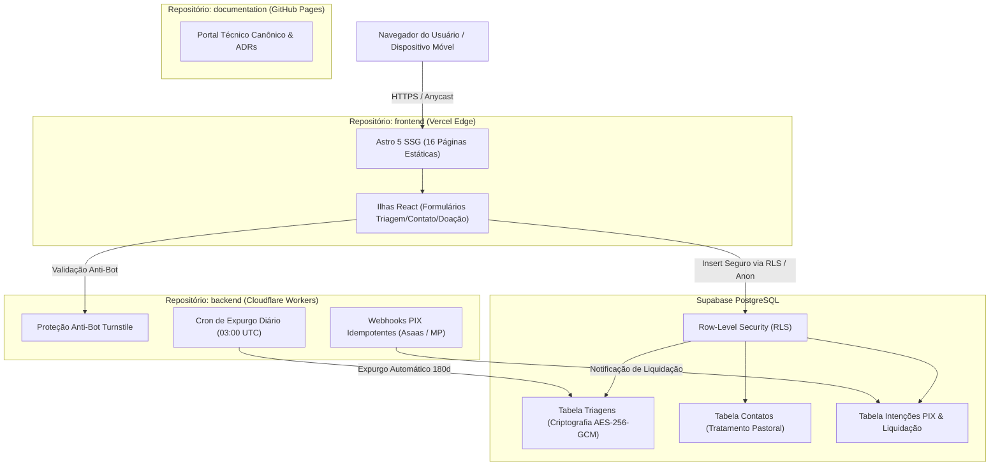

  

    ARQUITETURA CANÔNICA
  

  
  <h1 class="docs-hero-title">
    Pure Life Ministries Brasil 
    Engenharia de Software &amp; Governança
  </h1>
  
  

    Portal corporativo de especificações técnicas, decisões arquiteturais, governança de segurança da informação
    e conformidade irrestrita com a LGPD (Art. 11 &mdash; Dados Sensíveis). O ecossistema digital foi concebido para sustentar
    quatro décadas de aconselhamento bíblico sob estrito sigilo pastoral e alta disponibilidade na borda.
  

  

    <a href="architecture/system-overview/" class="md-button md-button--primary">Visão Geral da Arquitetura</a>
    <a href="architecture/repositories-scope/" class="md-button">Fronteiras dos Repositórios</a>
    <a href="security/threat-model/" class="md-button">Segurança &amp; LGPD</a>
    <a href="operations/deployment/" class="md-button">Runbooks Operacionais</a>
  

---

## Acesso Direto aos Recursos Técnicos

  

    

      

        <svg class="tech-icon" viewBox="0 0 24 24" fill="none" stroke="currentColor" stroke-width="2" stroke-linecap="round" stroke-linejoin="round" aria-hidden="true"><path d="M14 2H6a2 2 0 0 0-2 2v16a2 2 0 0 0 2 2h12a2 2 0 0 0 2-2V8z"></path><polyline points="14 2 14 8 20 8"></polyline><line x1="16" y1="13" x2="8" y2="13"></line><line x1="16" y1="17" x2="8" y2="17"></line></svg>
        Decisões de Arquitetura
      

      

        Registros formais (ADRs 001 a 005) com a fundamentação de escolhas tecnológicas, alternativas e trade-offs.
      

    

    <a href="adrs/index.md" class="four-card-link">
      Consultar ADRs &rarr;
    </a>
  

  

    

      

        <svg class="tech-icon" viewBox="0 0 24 24" fill="none" stroke="currentColor" stroke-width="2" stroke-linecap="round" stroke-linejoin="round" aria-hidden="true"><path d="M12 22s8-4 8-10V5l-8-3-8 3v7c0 6 8 10 8 10z"></path><path d="m9 12 2 2 4-4"></path></svg>
        Segurança &amp; LGPD
      

      

        Modelagem STRIDE, conformidade com o Artigo 11 para dados sensíveis e governança de chaves AES-256-GCM.
      

    

    <a href="security/threat-model/" class="four-card-link">
      Acessar Segurança &rarr;
    </a>
  

  

    

      

        <svg class="tech-icon" viewBox="0 0 24 24" fill="none" stroke="currentColor" stroke-width="2" stroke-linecap="round" stroke-linejoin="round" aria-hidden="true"><path d="M21 16V8a2 2 0 0 0-1-1.73l-7-4a2 2 0 0 0-2 0l-7 4A2 2 0 0 0 3 8v8a2 2 0 0 0 1 1.73l7 4a2 2 0 0 0 2 0l7-4A2 2 0 0 0 21 16z"></path><polyline points="3.27 6.96 12 12.01 20.73 6.96"></polyline><line x1="12" y1="22.08" x2="12" y2="12"></line></svg>
        Contratos &amp; Schemas
      

      

        Esquemas canônicos Zod/TypeScript para triagens, contatos, intenções de doação PIX e newsletters.
      

    

    <a href="schemas/triage-schema/" class="four-card-link">
      Ver Contratos &rarr;
    </a>
  

  

    

      

        <svg class="tech-icon" viewBox="0 0 24 24" fill="none" stroke="currentColor" stroke-width="2" stroke-linecap="round" stroke-linejoin="round" aria-hidden="true"><rect width="20" height="14" x="2" y="3" rx="2"></rect><line x1="8" x2="16" y1="21" y2="21"></line><line x1="12" x2="12" y1="17" y2="21"></line></svg>
        Operações &amp; Runbooks
      

      

        Guias de deploy na Vercel, observabilidade de Golden Signals, comandos CLI e planos de contingência.
      

    

    <a href="operations/observability/" class="four-card-link">
      Ver Runbooks &rarr;
    </a>
  

---

## Divisão Canônica em Três Repositórios

O ecossistema adota separação estrita de responsabilidades: **"Front com Front, Back com Back e Docs com Docs"**.

  

    

      repositório: frontend
    

    <h3 class="pillar-title">Interface Pública &amp; Borda</h3>
    

      Apresentação institucional compilada em HTML estático e blindada contra injeção de código ou vazamento de segredos.
    

    <ul class="pillar-list">
      <li>16 páginas estáticas pré-renderizadas com Astro 5 SSG</li>
      <li>Ilhas React isoladas exclusivamente para formulários interativos</li>
      <li>Tailwind CSS v4 com tokens tipográficos institucionais</li>
      <li>Zero credenciais privilegiadas (cliente público com chave anônima)</li>
      <li>Topologia 100% estática com verificação em CI/CD</li>
    </ul>
  

  

    <a href="architecture/repositories-scope/#a-repositorio-frontend-front-com-front" class="md-button md-button--primary">
      Escopo Frontend &rarr;
    </a>
  

  

    

      repositório: backend
    

    <h3 class="pillar-title">Serviços &amp; Webhooks PIX</h3>
    

      Microsserviços serverless na Cloudflare Workers para processamento financeiro assíncrono e rotinas de manutenção.
    

    <ul class="pillar-list">
      <li>Proteção anti-bot Cloudflare Turnstile nativa</li>
      <li>Webhooks PIX idempotentes para Asaas e Mercado Pago</li>
      <li>Validação criptográfica de assinaturas HMAC-SHA256</li>
      <li>Lease atômico contra processamento concorrente de pagamentos</li>
      <li>Rotina diária de expurgo de dados sensíveis (180 dias)</li>
    </ul>
  

  

    <a href="architecture/repositories-scope/#b-repositorio-backend-back-com-back" class="md-button md-button--primary">
      Escopo Backend &rarr;
    </a>
  

  

    

      repositório: documentation
    

    <h3 class="pillar-title">Governança &amp; Auditoria</h3>
    

      Repositório central de engenharia contendo especificações canônicas, registros de decisões e manuais operacionais.
    

    <ul class="pillar-list">
      <li>Portal MkDocs Material com validação estrita em pipeline</li>
      <li>Decisões de Arquitetura (ADRs 001 a 005) versionadas</li>
      <li>Especificação de Requisitos de Software (SRS)</li>
      <li>Modelagem de ameaças STRIDE e conformidade LGPD Art. 11</li>
      <li>Manuais de deploy, observabilidade e contingência</li>
    </ul>
  

  

    <a href="architecture/repositories-scope/#c-repositorio-documentation-docs-com-docs" class="md-button md-button--primary">
      Escopo Docs &rarr;
    </a>
  

---

## Topologia Geral da Arquitetura

