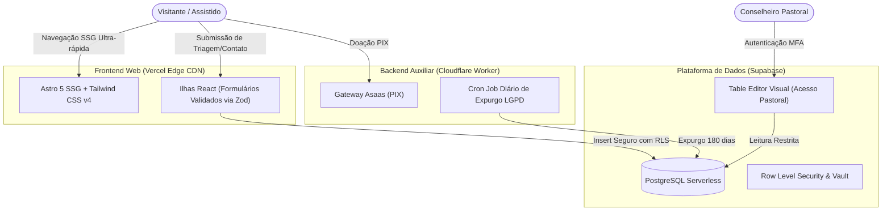

# Pure Life Ministries Brasil — Documentação Técnica

  

  <strong>Portal Canónico de Arquitetura, Engenharia, Segurança e Governança</strong> 
  <em>"Liderando Cristãos à Pureza desde 1986"</em>

---

## 1. Visão Geral do Ecossistema

O ecossistema digital da **Pure Life Ministries Brasil** foi concebido e arquitetado para atender à missão institucional da organização: oferecer acolhimento confidencial, cursos bíblicos, programa residencial e materiais pedagógicos para restauração sexual e espiritual à luz do evangelho de Cristo.

Por lidar com **dados altamente sensíveis** (relatos confessionais e triagens de sofrimento pessoal e familiar protegidos pelo sigilo pastoral e pelo Artigo 11 da LGPD), o sistema foi construído sob uma premissa inegociável:

> **Prioridade de Engenharia:**  
> **Corretude > Segurança & Privacidade > Observabilidade > Simplicidade > Velocidade de Entrega.**

---

## 2. Princípios Fundamentais de Arquitetura

### 1. Desempenho Extremo & Zero Atraso (Astro 5 SSG)
- **100% Páginas Estáticas Prerenderizadas:** As 16 rotas institucionais são compiladas em HTML estático no momento do build.
- **Zero CSS Residual Inline:** Estilização unificada via Tailwind CSS v4 com tokens de design centralizados.
- **Carregamento Instantâneo:** Hospedagem na CDN global da **Vercel**, atingindo pontuações máximas em Core Web Vitals (LCP < 1.0s, INP < 50ms, CLS = 0).

### 2. Gestão de Dados Descomplicada & Segura (Supabase)
- **Banco Relacional Robusto:** PostgreSQL gerenciado com isolamento de transações, integridade referencial e backups automáticos.
- **Row Level Security (RLS):** O frontend utiliza apenas chaves anônimas restritas a inserções (`INSERT ONLY`), impedindo que qualquer usuário leia registros de outros assistidos.
- **Painel Pastoral Intuitivo:** Os conselheiros acessam e atualizam o andamento dos atendimentos diretamente pelo *Table Editor* visual do Supabase, sem necessidade de CMSs legados ou complexos.

### 3. Privacidade Máxima por Padrão (LGPD & AppSec)
- **Criptografia de Campo:** Triagens e formulários pastorais sensíveis contam com rotinas de proteção criptográfica e restrição de acesso.
- **Expurgo Automático de Dados:** Política rigorosa de retenção (180 dias) com purga periódica automatizada para conformidade estrita com o Art. 11 da LGPD.
- **Proteção Anti-Bot:** Verificação transparente com Cloudflare Turnstile para impedir spam e ataques de negação de serviço.

---

## 3. Estrutura dos Repositórios Ativos

O projeto adota uma divisão pragmática e modular em 3 repositórios essenciais:

| Repositório | Tecnologia | Finalidade | Plataforma |
| :--- | :--- | :--- | :--- |
| **`frontend`** | Astro 5, Tailwind v4, React, Supabase-JS, Zod | Interface pública web, formulários de triagem, páginas ministeriais | **Vercel** |
| **`backend`** | TypeScript, Cloudflare Workers, Asaas SDK | Webhooks assíncronos de pagamento PIX e cron jobs de expurgo LGPD | **Cloudflare Workers** |
| **`documentation`** | MkDocs Material, Python, GitHub Pages | Documentação técnica oficial, ADRs, contratos e runbooks | **GitHub Pages** |

---

## 4. Guia Rápido de Leitura

- **Novo no projeto?** Comece pelo [Guia Rápido de Instalação](getting-started/quickstart.md) e configure as [Variáveis de Ambiente](getting-started/environment.md).
- **Entendendo a Engenharia:** Explore a [Visão Geral do Sistema](architecture/system-overview.md) e o [Modelo de Dados no Supabase](architecture/data-model.md).
- **Decisões Técnicas:** Leia os [Registros de Decisões de Arquitetura (ADRs)](adrs/index.md) para compreender o motivo da adoção de cada tecnologia.
- **Operação e Deploy:** Consulte os runbooks de [Deploy na Vercel](operations/deployment.md) e [Backup & Recuperação](operations/backup-recovery.md).
