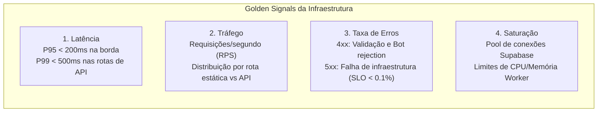
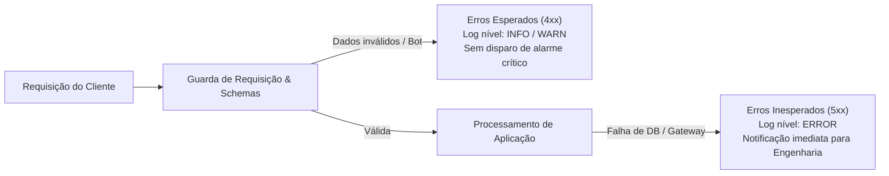

# Observabilidade, Telemetria & Monitoramento

A estratégia de observabilidade da **Pure Life Ministries Brasil** é orientada pela estrita proteção de privacidade pastoral e conformidade legal com a **LGPD (Art. 11 — Dados Sensíveis)**. Nosso modelo garante visibilidade proativa do estado da infraestrutura sem violar o sigilo ministerial.

---

## 1. Princípio Fundamental de Sigilo de Dados

> [!CAUTION] Regra Inviolável de Telemetria
> **Nenhum dado confidencial de aconselhamento, nome de aconselhado, relato de pecado, telefone, e-mail ou cabeçalho de autorização pode constar em logs legíveis por humanos, traces APM ou relatórios de erro.**
> A observabilidade mede a saúde e a integridade dos processos técnicos, nunca o conteúdo espiritual ou pessoal dos fiéis.

O ecossistema implementa o componente canônico `scrubber.ts` no `backend`, que remove automaticamente quaisquer chaves sensíveis na camada de geração de eventos.

---

## 2. Os Quatro Sinais Dourados (Golden Signals)

O monitoramento operacional é centralizado nos quatro pilares essenciais:



| Sinal | Métrica Principal | Meta / SLA | Ferramenta de Monitoramento |
| :--- | :--- | :--- | :--- |
| **Latência** | Tempo de resposta P95 / P99 | P95 < 200ms (Static), P95 < 400ms (API) | Vercel Analytics / Cloudflare Dashboard |
| **Tráfego** | Volume total de acessos e requisições/minuto | Escala dinâmica sem degradação | Cloudflare Analytics / Vercel Edge |
| **Erros** | Percentual de códigos HTTP 5xx | < 0,05% das requisições totais | Cloudflare Logs / Vercel Monitoring |
| **Saturação** | Utilização de conexões e memória | < 70% de capacidade nos picos | Supabase Metrics Dashboard |

---

## 3. Taxonomia de Erros e Respostas

Para facilitar a triagem de incidentes sem poluir os alertas com ruído, o sistema classifica as falhas em duas macrocategorias:



### A. Erros Esperados (Client-Side / Bot Traps)
* **`400 Bad Request`**: JSON malformado ou payload sintaticamente inválido.
* **`403 Forbidden`**: Token Cloudflare Turnstile rejeitado (falha no desafio anti-bot).
* **`413 Payload Too Large`**: Submissão acima do limite rígido (8 KB para formulários, 4 KB para PIX).
* **`422 Unprocessable Content`**: Falha na validação semântica do esquema Zod.

### B. Erros Inesperados (Server-Side / Infraestrutura)
* **`502 Bad Gateway`**: Indisponibilidade no gateway Asaas ou Mercado Pago na geração do PIX.
* **`503 Service Unavailable`**: Supabase inacessível ou falha temporária de pool de conexões.
* **`500 Internal Server Error`**: Exceção não capturada no Worker.

---

## 4. Estrutura Canônica de Log Sanitizado

Todos os eventos emitidos pelo backend seguem o formato JSON estruturado com correlação por `requestId`:

```json
{
  "timestamp": "2026-09-25T23:20:00.000Z",
  "requestId": "cf-ray-8eefce12345",
  "environment": "production",
  "service": "purelife-api",
  "method": "POST",
  "path": "/api/forms/triagem",
  "statusCode": 200,
  "durationMs": 142,
  "clientIp": "203.0.113.195",
  "turnstileStatus": "verified",
  "payload": {
    "programInterest": "residencial",
    "isAdult": true,
    "fullName": "[REDACTED]",
    "email": "[REDACTED]",
    "phone": "[REDACTED]",
    "report": "[REDACTED]"
  }
}
```

---

## 5. Verificação de Saúde (Health Check Endpoint)

O serviço de API expõe uma rota pública e idempotente para checagens automatizadas de disponibilidade:

* **Endpoint:** `GET /health`
* **Comportamento:** Retorna status `healthy`, timestamp e versão sem tocar no banco de dados, ideal para sondas de liveness do Cloudflare ou uptime monitors externos.

```bash
curl -i https://api.purelifebrasil.org/health
```

**Resposta esperada (HTTP 200):**
```json
{
  "status": "healthy",
  "service": "purelife-api",
  "timestamp": "2026-09-25T23:21:00.000Z",
  "version": "5.0.0"
}
```

---

## 6. Procedimento de Alertas e Limiares Operacionais

1. **Alerta de Erros 5xx na Borda:**
   * **Gatilho:** > 10 erros 5xx em uma janela contínua de 5 minutos.
   * **Ação:** Verificar o status do Supabase e credenciais dos gateways de pagamento.
2. **Alerta de Expiração de Certificados e Webhooks:**
   * **Gatilho:** Falhas consecutivas de validação de assinatura HMAC em `/api/webhooks/payment`.
   * **Ação:** Inspecionar divergência de segredos ou rotação pendente no portal Asaas/Mercado Pago.
3. **Alerta de Expurgo LGPD Incompleto:**
   * **Gatilho:** Cron trigger `0 3 * * *` com falha de execução reportada.
   * **Ação:** Consultar o log do Worker agendado e executar a rotina de expurgo manualmente se necessário.
