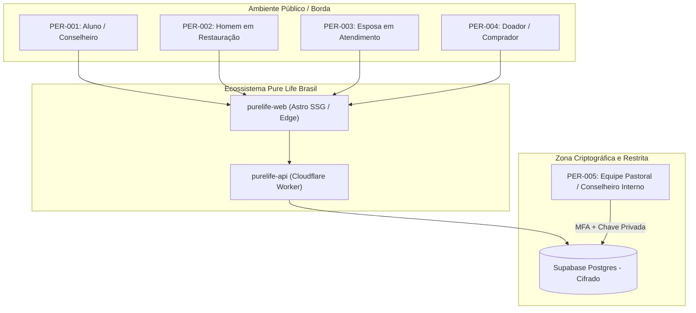
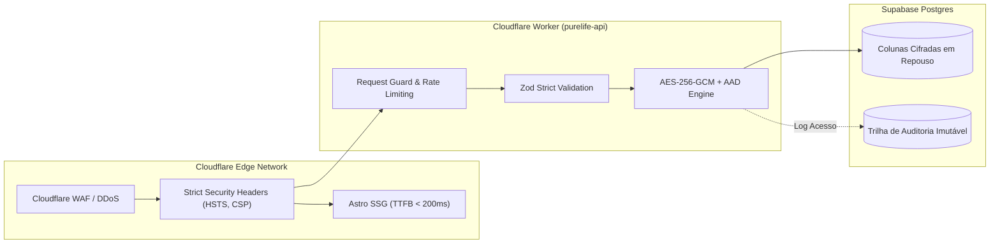
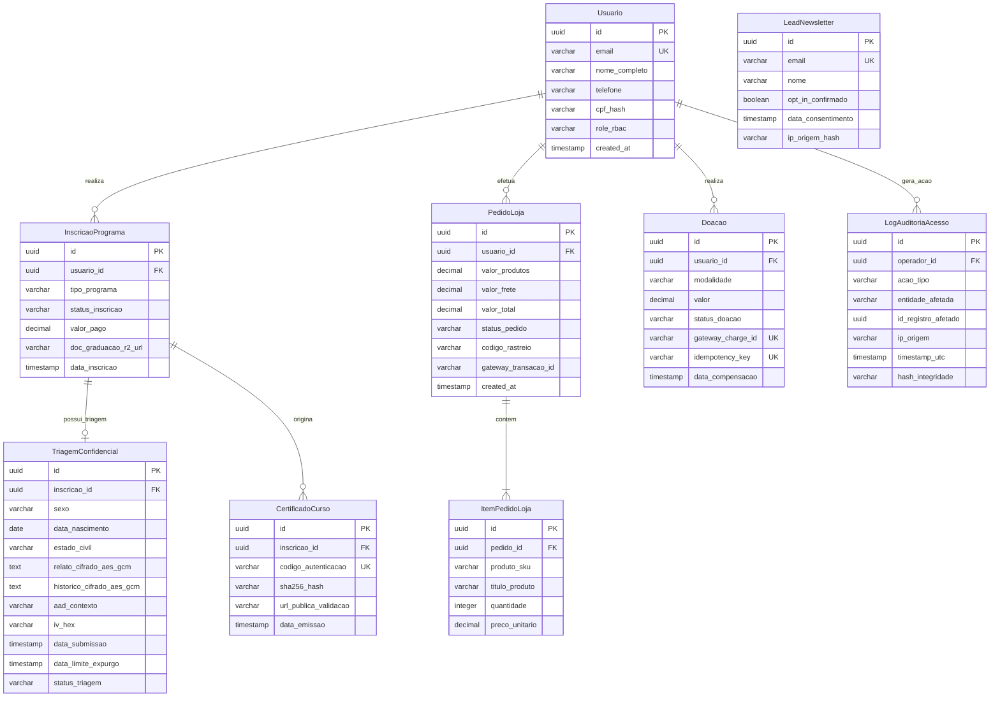

# Especificação de Requisitos do Sistema (SRS) — Ecossistema Digital Pure Life Ministries Brasil

**Documento Canónico de Engenharia de Requisitos e Governança de Dados**  
**Versão:** 2.0.0 (Modernizada: Supabase & Vercel)  
**Data:** Setembro de 2026  
**Status:** Aprovado / Canónico  
**Classificação:** Uso Oficial Interno e Engenharia de Software  
**Autor:** Engenheiro de Requisitos Sênior & Especialista em Governança de Dados (LGPD)  
**Conformidade:** LGPD (Lei Federal nº 13.709/2018), Especificação Técnica de Arquitetura v5.0, OWASP ASVS v4.0.3

---

## 0. Sumário Executivo e Escopo do Ecossistema

O presente documento estabelece a especificação formal, exaustiva e auditável de todos os requisitos do ecossistema digital da **Pure Life Ministries Brasil** (`purelifeministriesbrasil.org`). O ecossistema opera sob uma arquitetura multirepo enxuta e desacoplada composta por 3 repositórios essenciais, orientada pelo princípio "Front com Front, Back com Back, Docs com Docs":

1. `purelife-web` (`frontend`): Aplicação em Astro 5 SSG, Tailwind CSS v4, microinterações e Ilhas React restritas, hospedada na **Vercel** com cliente nativo Supabase e schemas Zod internos.
2. `purelife-api` (`backend`): Cloudflare Worker independente com Clean Architecture / DDD, integração ao gateway Asaas (PIX Dinâmico) e rotinas cron de expurgo LGPD no **Supabase Postgres**.
3. `purelife-docs` (`documentation`): Documentação canónica técnica, ADRs, runbooks e este SRS compilados com **Material for MkDocs** e publicados via GitHub Pages.

O sistema atende a cinco macrodomínios funcionais:
- **Núcleo de Aconselhamento Bíblico:** Triagem confidencial e gestão de programas de restauração (Residencial, Vencedores em Casa, Para Esposas e Aconselhamento Suplementar).
- **Plataforma Educacional (Cursos & Formação):** Capacitação e Pós-Graduação em Aconselhamento Bíblico e Distúrbios da Sexualidade.
- **Doações & Sustentabilidade Financeira:** Ingestão de doações pontuais e recorrentes via Pix e Cartão de Crédito.
- **Loja Virtual / Materiais:** Comercialização de literatura especializada e apostilas didáticas.
- **Eventos & Conferências:** Inscrição, credenciamento e emissão de ingressos para conferências anuais de treinamento.

---

## Seção A: Mapeamento de Stakeholders & Personas

O ecossistema atende perfis com demandas acentuadamente heterogêneas de sigilo, usabilidade e privilégios operacionais. A classificação de acesso obedece ao modelo de Controle de Acesso Baseado em Papéis (RBAC).



### PER-001: Aluno / Conselheiro Bíblico em Formação
- **Descrição do Perfil:** Pastor, presbítero, líder ministerial, missionário ou profissional de saúde cristão que busca capacitação teológica e prática para aconselhar pessoas presas em hábitos sexuais compulsivos.
- **Dores Principais:** Escassez de capacitação confessional biblicamente sólida em língua portuguesa; falta de metodologias práticas estruturadas para lidar com pornografia e distúrbios sexuais nas igrejas locais; burocracia na submissão e validação de diplomas de graduação para cursos de especialização.
- **Objetivos no Sistema:**
  1. Conhecer a grade curricular e matricular-se no curso de *Capacitação em Aconselhamento Bíblico e Distúrbios da Sexualidade* (R$ 3.120,00) ou na *Pós-Graduação* (R$ 2.160,00).
  2. Fazer upload de documentos comprobatórios exigidos para pós-graduação (diploma de graduação e documento com foto).
  3. Acompanhar status da matrícula e validar autenticidade do certificado emitido.
- **Sensibilidade ao Anonimato:** **Média-Baixa**. Os dados são de natureza cadastral e acadêmica. Não há coleta de confissão de conduta pessoal íntima.
- **Nível de Acesso (RBAC):** `ALUNO_CURSO` (acesso restrito aos dados da própria matrícula, envio de comprovantes e download de certificados).

### PER-002: Homem em Busca de Restauração / Triagem Confidencial
- **Descrição do Perfil:** Homem cristão ($\ge 18$ anos), casado ou solteiro, vivenciando colapso espiritual, pessoal ou matrimonial decorrente do aprisionamento em pornografia, masturbação crônica, adultério ou outras manifestações de pecado sexual.
- **Dores Principais:** Terror absoluto de ter sua intimidade exposta a familiares, líderes da igreja local ou empregadores; sensação paralisante de culpa e impotência após anos de tentativas frustradas de superação; hesitação em preencher formulários online por medo de vazamento cibernético.
- **Objetivos no Sistema:**
  1. Compreender os requisitos e rotinas do *Programa Residencial* (9 meses, presencial no campus em Águas Lindas de Goiás / DF) e do *Programa Vencedores em Casa* (6 meses, remoto).
  2. Preencher e submeter formulário de triagem inicial detalhado, relatando seu histórico com a garantia de cifragem ponta a ponta e sigilo pastoral estrito.
  3. Receber orientações de acolhimento pastoral e agendamento de entrevista de admissão.
- **Sensibilidade ao Anonimato:** **MÁXIMA / CRÍTICA (Art. 11 LGPD)**. O vazamento desses registros acarreta dano moral irreparável, dissolução familiar, ostracismo social e potencial perda de subsistência.
- **Nível de Acesso (RBAC):** `CANDIDATO_TRIAGEM` / `ACOLHIDO_RESIDENCIAL` (submissão cega; após o envio, o candidato não mantém sessão autenticada que exponha a confissão enviada).

### PER-003: Esposa em Atendimento e Restauração Conjugal
- **Descrição do Perfil:** Mulher casada que descobriu o envolvimento secreto do cônjuge com pornografia, traição ou prostituição, vivenciando o choque do trauma de traição (*Betrayal Trauma*).
- **Dores Principais:** Devastação emocional profunda, desconfiança paralisante em relação ao cônjuge e a lideranças religiosas, sensação de isolamento extremo e falta de suporte especializado que compreenda sua dor sem julgamentos.
- **Objetivos no Sistema:**
  1. Conhecer a metodologia do programa especializado *Para Esposas* (18 semanas, R$ 1.600,00, conduzido por conselheiras que já superaram a mesma dor).
  2. Preencher questionário de admissão confidencial de forma discreta e segura.
  3. Agendar sessões remotas e ter acesso aos materiais de apoio emocional e bíblico.
- **Sensibilidade ao Anonimato:** **MÁXIMA / CRÍTICA (Art. 11 LGPD)**. Qualquer vazamento viola a intimidade conjugal e a dignidade pessoal da aconselhanda.
- **Nível de Acesso (RBAC):** `ACONSELHANDA_ESPOSA` (visão restrita à sua própria conselheira designada e aos materiais exclusivos do programa).

### PER-004: Doador / Mantenedor / Comprador da Loja
- **Descrição do Perfil:** Membro da comunidade, igreja parceira, ex-aluno ou simpatizante que deseja contribuir financeiramente com o ministério ou adquirir literatura de edificação.
- **Dores Principais:** Falta de canais de doação modernos e confiáveis (ex.: Pix imediato ou recorrência em cartão sem atrito); lentidão no cálculo de frete para literatura impressa; falta de recibos para controle financeiro.
- **Objetivos no Sistema:**
  1. Realizar doação única ou programar mantenedoria mensal via Pix dinâmico ou cartão de crédito.
  2. Adquirir livros (ex.: "Pilha de Máscaras" de Steve Gallagher) e apostilas de cursos com cálculo transparente de frete.
  3. Receber confirmação instantânea por e-mail com comprovante de doação e código de rastreamento postal.
- **Sensibilidade ao Anonimato:** **Baixa-Média**. Dados financeiros e fiscais usuais protegidos pelo sigilo bancário e disposições gerais da LGPD.
- **Nível de Acesso (RBAC):** `DOADOR_COMPRADOR` / `ANONIMO` (checkout seguro sem necessidade de criação obrigatória de conta para doar).

### PER-005: Equipe Pastoral, Conselheiros e Administrador do Sistema
- **Descrição do Perfil:** Diretor do campus, pastores conselheiros certificados e administradores internos responsáveis pelo acolhimento, triagem e governança da instituição.
- **Dores Principais:** Risco de vazamento de prontuários pastorais físicos ou planilhas compartilhadas; necessidade de cumprir prazos legais da LGPD para retenção e expurgo de relatos de triagem; dificuldade de rastrear auditoria de acessos a dados sensíveis.
- **Objetivos no Sistema:**
  1. Acessar painel administrativo restrito com autenticação multifator (MFA) e chave criptográfica para visualização de triagens recebidas.
  2. Moderar triagens, registrar notas de avaliação e aprovar admissões de candidatos ao campus.
  3. Gerenciar catálogo de cursos, inscrições em eventos e conciliação de doações.
  4. Emitir relatórios de auditoria e gerenciar a rotina de expurgo criptográfico de 180 dias.
- **Sensibilidade ao Anonimato:** Não aplicável ao operador; opera sob estrito **sigilo pastoral e sacerdotal**.
- **Nível de Acesso (RBAC):** `CONSELHEIRO_PASTORAL`, `ADMINISTRADOR_SISTEMA` (acesso granulado, cada leitura de registro sensível gera log imutável de auditoria com IP e timestamp).

---

## Seção B: Catálogo de Requisitos Funcionais (RF)

Os requisitos funcionais foram mapeados com base na decomposição dos módulos operacionais ativos no portal oficial `purelifeministriesbrasil.org`. A priorização segue a metodologia **MoSCoW** (*Must Have*, *Should Have*, *Could Have*, *Won't Have*).

| ID | Módulo | Descrição do Requisito | Entradas / Gatilhos | Saídas / Comportamento do Sistema | Prioridade |
|---|---|---|---|---|---|
| **RF-001** | Aconselhamento | Submissão de Formulário de Triagem Confidencial para Programa Residencial. | Formulário web: dados biográficos, endereço, estado civil, histórico detalhado de adicção sexual e consentimento explícito LGPD Art. 11. | Validação estrita via Zod; cifragem do relato confidencial com AES-256-GCM + AAD; persistência no Supabase Postgres; disparo de notificação sigilosa à equipe pastoral. | **Must Have** |
| **RF-002** | Aconselhamento | Inscrição no Programa "Vencedores em Casa" (6 meses, remoto/híbrido). | Formulário web com dados pessoais, relato sintético da demanda, indicação de disponibilidade de horário e escolha de forma de pagamento (R$ 2.000,00). | Registro da inscrição com status `AGUARDANDO_AVALIACAO`; bloqueio de menores de 16 anos; geração de intenção de pagamento. | **Must Have** |
| **RF-003** | Aconselhamento | Inscrição no Programa "Para Esposas" (18 semanas, remoto). | Formulário exclusivo feminino com relato da situação conjugal, telefone/WhatsApp de contato seguro e confirmação de consentimento específico. | Validação de elegibilidade (sexo feminino, $\ge 18$ anos); geração de registro cifrado; encaminhamento direto à coordenadora do programa feminino. | **Must Have** |
| **RF-004** | Aconselhamento | Solicitação de Aconselhamento Bíblico Suplementar pós-programa. | Aconselhado egresso submete código de formando e solicitação de ciclo suplementar de até 6 sessões semanais. | Validação de egresso no banco de dados; aplicação da regra de alocação de novo conselheiro (RN-008); criação do ciclo de acompanhamento. | **Should Have** |
| **RF-005** | Aconselhamento | Painel de Moderação e Avaliação Pastoral de Triagens. | Conselheiro autenticado com MFA acessa lista de triagens pendentes com chave de decifragem autorizada. | Renderização segura de dados confidenciais decifrados em memória volátil; registro automático de leitura em trilha de auditoria; opções de aprovação, recusa ou arquivamento. | **Must Have** |
| **RF-006** | Aconselhamento | Acompanhamento de Tarefas Semanais (*Homework*) e Agendamento. | Conselheiro ou aconselhado registra conclusão de leitura bíblica, devocionais e agenda sessão semanal por vídeo/telefone. | Atualização do prontuário pastoral do aconselhado; registro de presença e evolução espiritual. | **Should Have** |
| **RF-007** | Governança | Rotina de Expurgo Criptográfico Automático de Triagens Expiradas. | Gatilho temporal diário (Cron Worker) inspeciona triagens pendentes não convertidas com idade $\ge 180$ dias. | Sobrescrita criptográfica dos campos sensíveis (`relato_confidencial`, `historico`) e destruição definitiva da DEK associada; registro de expurgo na trilha de auditoria. | **Must Have** |
| **RF-008** | Educação | Matrícula no Curso de Capacitação em Aconselhamento Bíblico (R$ 3.120,00). | Seleção do curso na vitrine educacional, dados cadastrais do aluno, dados de cobrança e forma de pagamento. | Processamento do pagamento via gateway; geração de ID de matrícula; envio de credenciais de acesso e recibo por e-mail. | **Must Have** |
| **RF-009** | Educação | Inscrição com Upload de Documentos para Pós-Graduação (R$ 2.160,00). | Formulário de inscrição com upload seguro de diploma de graduação (PDF/PNG até 5MB) e documento oficial de identidade. | Validação de formato MIME e hash SHA-256 do arquivo; armazenamento em bucket Cloudflare R2 isolado; status da matrícula fixado em `PENDENTE_DOCUMENTACAO`. | **Must Have** |
| **RF-010** | Educação | Validação Documental e Homologação de Alunos de Pós-Graduação. | Administrador acadêmico avalia documentos submetidos no painel interno e emite parecer de deferimento/indeferimento. | Atualização do status da matrícula para `HOMOLOGADO` ou `DOCUMENTACAO_RECUSADA`; envio de e-mail transacional com justificativa. | **Should Have** |
| **RF-011** | Educação | Emissão e Validação Pública de Certificados de Conclusão. | Sistema processa conclusão de carga horária e emite certificado digital assinado com hash SHA-256 e código QR. | Disponibilização de página pública de validação em Astro SSG (`/validar-certificado/[codigo]`) com consulta direta ao hash registrado no Supabase Postgres. | **Should Have** |
| **RF-012** | Doações | Doação Pontual via Pix com Geração Dinâmica de QR Code Copia e Cola. | Seleção de valor pré-definido ou valor livre (mínimo R$ 10,00), nome, e-mail e CPF do doador. | Chamada à API do gateway de pagamento; geração de payload Pix EMV com expiração de 15 minutos; exibição na tela sem recarregar a página. | **Must Have** |
| **RF-013** | Doações | Doação Recorrente Mensal via Cartão de Crédito. | Seleção de plano mensal, token seguro de cartão de crédito gerado via SDK do gateway na borda, dados do titular. | Criação de assinatura no gateway financeiro; persistência da assinatura no Supabase Postgres; agendamento de cobrança recorrente com webhooks de acompanhamento. | **Must Have** |
| **RF-014** | Doações | Processamento Idempotente de Webhooks de Pagamento e Doação. | Recebimento de payload HTTP POST do gateway financeiro com assinatura HMAC no cabeçalho. | Verificação criptográfica da assinatura do webhook; obtenção de lease atômico via `pg_try_advisory_xact_lock` no Supabase Postgres; conciliação financeira do pedido/doação. | **Must Have** |
| **RF-015** | Doações | Emissão de Comprovante de Doação Eclesiástica por E-mail. | Evento de confirmação de compensação bancária da doação. | Geração de recibo em formato PDF ou HTML assinado contendo dados da instituição (CNPJ) e doação; disparo seguro por serviço transacional de e-mail. | **Should Have** |
| **RF-016** | Loja / Materiais | Catálogo de Livros e Apostilas Didáticas. | Requisição GET pública para a vitrine da loja virtual (`/cursos-e-conferencias/` ou `/loja/`). | Renderização instantânea em Astro SSG dos produtos (ex.: livro "Pilha de Máscaras" a R$ 50,00, apostilas de cursos a R$ 199,00 e R$ 219,00). | **Must Have** |
| **RF-017** | Loja / Materiais | Cálculo Dinâmico de Frete com Correios / Melhor Envio. | Usuário informa CEP de destino na página do carrinho ou checkout. | Consulta segura à API de frete (SEDEX e PAC); retorno de prazos e valores; inclusão no subtotal do pedido. | **Should Have** |
| **RF-018** | Loja / Materiais | Checkout Transparente e Criação de Pedido de Literatura. | Itens do carrinho, endereço completo de entrega, dados fiscais e meio de pagamento escolhido. | Validação de estoque; criação do registro `PedidoLoja` com status `AGUARDANDO_PAGAMENTO`; retorno das instruções de liquidação. | **Must Have** |
| **RF-019** | Loja / Materiais | Atualização de Status de Entrega e Código de Rastreamento. | Administrador insere código de rastreio postal no painel após envio físico do material. | Atualização do status para `ENVIADO`; envio automático de e-mail ao comprador com link dos Correios. | **Could Have** |
| **RF-020** | Eventos | Inscrição na Conferência de Treinamento Avançado em Distúrbios da Sexualidade. | Seleção da conferência (ex.: Nível 1: Fundamentos a R$ 100,00), dados dos participantes e pagamento. | Registro de inscrição com alocação de vaga; emissão de credencial digital com código de barras/QR Code de acesso. | **Must Have** |
| **RF-021** | Eventos | Credenciamento Presencial e Check-in com Leitor de QR Code. | Staff do evento faz a leitura do QR Code do participante no dia da conferência através de aplicação móvel/web. | Validação da autenticidade da credencial; marcação do check-in como realizado; bloqueio contra tentativas de reuso da mesma credencial. | **Should Have** |
| **RF-022** | Comunicação | Captura de Lead para Newsletter Mensal (eNews) com Duplo Opt-in. | Submissão de e-mail e nome no formulário de rodapé ou modal institucional. | Envio de e-mail com link de confirmação de consentimento; ativação do lead apenas após clique no link de validação. | **Must Have** |
| **RF-023** | Editorial | Exibição de Depoimentos Editoriais Sanitizados e Autorizados. | Requisição pública às páginas de depoimentos e histórias de transformação. | Renderização de depoimentos estáticos gerados via Astro a partir do Supabase / coleções de conteúdo estáticas, contendo apenas registros explicitamente autorizados com nomes abreviados. | **Must Have** |
| **RF-024** | Atendimento | Encaminhamento Seguro para Acolhimento Pré-Triagem via WhatsApp. | Clique no botão de contato institucional de suporte via WhatsApp (`(61) 99566-1936`). | Redirecionamento com mensagem predefinida sanitizada sem inclusão de parâmetros de URL contendo dados pessoais ou diagnósticos na querystring. | **Should Have** |
| **RF-025** | Auditoria | Trilha de Auditoria Imutável de Acessos a Registros Confidenciais. | Qualquer operação de visualização, exportação, edição ou expurgo de dados sensíveis realizada por conselheiro ou administrador. | Inserção imediata e não editável de registro na tabela `LogAuditoriaAcesso` com ID do operador, registro visualizado, IP, timestamp UTC e hash de integridade. | **Must Have** |

---

## Seção C: Catálogo de Regras de Negócio (RN)

As regras de negócio estabelecem as invariantes canónicas, restrições operacionais e exigências éticas e legais que regem a operação do ministério.

### RN-001: Elegibilidade Exclusiva para o Programa Residencial
- **Enunciado:** O Programa Residencial de 9 meses (localizado no campus em Setor Colonial Parque II – Padre Lúcio, Águas Lindas de Goiás – GO / DF) destina-se com exclusividade a indivíduos do sexo biológico masculino com idade igual ou superior a 18 anos completos na data de ingresso no campus.
- **Justificativa Operacional:** O regime de internato coletivo em alojamentos masculinos compartilhados demanda maturidade civil e adequação às normas regimentais do campus.
- **Condições Financeiras:** A inscrição inicial para triagem é totalmente gratuita. Nenhum valor é cobrado até que a oferta formal de admissão seja emitida pela diretoria pastoral. Confirmada a admissão, é devida taxa de matrícula de R$ 500,00 e mensalidade de R$ 1.000,00 durante a Fase I (primeiros 6 meses), cobrindo hospedagem e alimentação.
- **Invariante no Sistema:** O validador de formulário do `purelife-contracts` (`triagemResidencialSchema`) deve rejeitar qualquer requisição com `sexo !== "MASCULINO"` ou `dataNascimento` que resulte em idade inferior a 18 anos.

### RN-002: Elegibilidade para o Programa "Vencedores em Casa"
- **Enunciado:** O Programa "Vencedores em Casa" (6 meses, remoto/híbrido, investimento de R$ 2.000,00) é destinado a homens que não possuem disponibilidade para regime de internato, mulheres enfrentando adicção ou hábitos sexuais compulsivos, e adolescentes com maturidade comprovada (idade mínima de 16 anos).
- **Tratamento de Menores (Art. 14 LGPD):** Para candidatos com idade entre 16 e 17 anos completos, o sistema exige obrigatoriamente o envio e confirmação do termo de consentimento dos pais ou responsáveis legais, contendo CPF e assinatura digital ou firma reconhecida do responsável.
- **Invariante no Sistema:** Inscrições de menores de 16 anos são bloqueadas preventivamente. Inscrições entre 16 e 17 anos entram automaticamente no status de trava `AGUARDANDO_CONSENTIMENTO_RESPONSAVEL`.

### RN-003: Elegibilidade para o Programa "Para Esposas"
- **Enunciado:** O Programa "Para Esposas" (18 semanas, remoto, investimento de R$ 1.600,00) é exclusivo para pessoas do sexo biológico feminino, com idade igual ou superior a 18 anos, que sejam cônjuges de homens envolvidos em pornografia, infidelidade ou pecados sexuais secretos.
- **Condução Pastoral:** O acompanhamento é conduzido estritamente por conselheiras mulheres que completaram o programa e possuem testemunho público de restauração matrimonial.
- **Invariante no Sistema:** Submissões com sexo diferente de "FEMININO" ou estado civil "SOLTEIRA" sem justificativa conjugal devem ser direcionadas pela interface para os outros canais de aconselhamento apropriados.

### RN-004: Exigência Documental para Homologação em Pós-Graduação
- **Enunciado:** A matrícula no curso de *Pós-Graduação em Aconselhamento Bíblico e Distúrbios da Sexualidade* (R$ 2.160,00) depende da comprovação formal de conclusão de curso de graduação de nível superior (bacharelado ou licenciatura reconhecido pelo MEC).
- **Fluxo Operacional:** A compensação do pagamento não garante o início imediato das aulas de pós-graduação. O aluno tem prazo de 30 dias para submeter o diploma de graduação em formato PDF legível. Caso os documentos não sejam submetidos ou apresentem irregularidades, a inscrição é cancelada e o valor pago é estornado conforme o Código de Defesa do Consumidor e termos contratuais.

### RN-005: Segregação e Governança de Dados no Supabase Postgres
- **Enunciado:** É terminantemente proibido expor dados confidenciais de triagem, confissões ou PII de aconselhados sem Row Level Security (RLS) restrito e isolamento criptográfico.
- **Separação de Papéis:**
  - O conteúdo editorial público (artigos, sermões, vídeos, detalhes da grade de cursos) é mantido em coleções estáticas do Astro e gerenciado pelo Supabase Table Editor com políticas RLS restritas para leitura pública apenas de registros publicados.
  - O Supabase Postgres armazena triagens, pedidos de loja, doações e matrículas com políticas `INSERT ONLY` para chaves anônimas (`anon`), exigindo credenciais com MFA pastoral para visualização.
- **Isolamento de Credenciais:** As chaves anônimas públicas (`anon_key`) jamás possuem permissão de leitura sobre tabelas de triagens ou contatos. Qualquer depoimento exibido publicamente no site deve possuir consentimento assinado em cartório e nomes anonimizados no próprio documento editorial.

### RN-006: Moderação Pastoral e Expurgo Temporal de Triagens
- **Enunciado:** Formulários de triagem submetidos que não forem convertidos em matrícula efetiva no Programa Residencial ou no Vencedores em Casa no prazo limite de **180 dias corridos** devem ser automaticamente expurgados do banco de dados operacional.
- **Procedimento Criptográfico de Expurgo:** O expurgo é implementado via sobrescrita dos campos cifrados por valor nulo ou bytes aleatórios e destruição definitiva da chave de cifragem de linha (DEK), tornando qualquer recuperação matemática impossível. Os metadados não sensíveis (UF, data do recebimento e motivo do encerramento) são preservados de forma estatística e anonimizada para prestação de contas pastoral.

### RN-007: Idempotência Obrigatória em Transações Financeiras e Webhooks
- **Enunciado:** Toda requisição de checkout, criação de Pix ou notificação de webhook de gateway de pagamento deve conter um identificador único de idempotência (`Idempotency-Key` ou `Transaction-ID`).
- **Prevenção de Concorrência:** O Cloudflare Worker deve adquirir trava atômica no Supabase Postgres utilizando `pg_try_advisory_xact_lock(hashtext(idempotency_key))` durante a transação. Caso a trava já esteja retida por outra requisição idêntica, a requisição concorrente deve ser rejeitada com código HTTP `409 Conflict` ou aguardar o término da transação anterior, impedindo cobranças duplicadas ou credenciamentos duplicados.

### RN-008: Regra de Conselheiro Suplementar Distinto
- **Enunciado:** Ao contratar o ciclo de Aconselhamento Bíblico Suplementar (até 6 sessões semanais após a formatura do programa principal), o sistema deve alocar, de forma intencional e automática, um conselheiro bíblico diferente daquele que atendeu o aconselhado durante o programa residencial ou remoto anterior.
- **Justificativa Pastoral:** Proporcionar uma visão externa e neutra de um novo líder ministerial experiente, reforçando a prestação de contas e a consolidação dos hábitos de santidade sem criar dependência emocional exclusiva com um único conselheiro.

### RN-009: Revogação Instantânea de Acesso Operacional (Kill-Switch de Staff)
- **Enunciado:** Qualquer alteração no status de um conselheiro, coordenador ou administrador pastoral para `INATIVO` ou `REVOGADO` no painel central deve invalidar imediatamente todas as sessões ativas (JWT/Session tokens) e revogar os privilégios de descriptografia de triagens em no máximo 60 segundos em toda a borda da Cloudflare.

---

## Seção D: Requisitos Não-Funcionais (RNF) e Conformidade LGPD

Os requisitos não-funcionais estabelecem os padrões de segurança cibernética, privacidade em conformidade com a Lei Geral de Proteção de Dados (LGPD - Lei nº 13.709/2018), desempenho e resiliência da infraestrutura.



### RNF-001: Tratamento Rigoroso de Dados Pessoais Sensíveis (Art. 11 LGPD)
- **Classificação Legal:** Todas as informações coletadas que envolvam histórico de adicção sexual, pornografia, relatos de infidelidade, conduta conjugal e convicção religiosa e confessional enquadram-se categoricamente como **Dados Pessoais Sensíveis** nos termos do **Art. 5º, inciso II** e **Art. 11** da Lei nº 13.709/2018.
- **Bases Legais Vinculantes:**
  1. *Art. 11, inciso I:* Consentimento específico, destacado, livre e informado do titular.
  2. *Art. 11, inciso II, alínea "f":* Proteção da vida ou da incolumidade física do titular ou de terceiros (aplicável em casos de risco iminente de automutilação ou desespero emocional grave identificado na triagem).
- **Proibição de Finalidade Secundária:** É terminantemente proibido o compartilhamento, venda, enriquecimento ou uso de dados de triagem para fins de marketing institucional, publicidade ou treinamento de modelos de inteligência artificial.

### RNF-002: Consentimento Atômico e Granular na Ingestão de Dados
- **Implementação Técnica:** A interface do usuário não deve apresentar consentimentos genéricos ou caixas de seleção previamente marcadas (*opt-in* forçado proibido).
- **Granularidade:** Formulários de aconselhamento devem exigir três confirmações atômicas e obrigatórias:
  1. Aceite dos Termos de Aconselhamento Bíblico Confessional e Regimento Interno.
  2. Consentimento explícito e destacado para Tratamento de Dados Pessoais Sensíveis de Vida Sexual e Convicção Religiosa (Art. 11 da LGPD).
  3. Reconhecimento de que os relatos são submetidos a sigilo pastoral sacerdotal da equipe da Pure Life Ministries Brasil.
- **Evidência de Consentimento:** O registro da submissão no banco de dados deve persistir: `versao_termo_aceita`, `timestamp_utc_consentimento`, `ip_origem_hasheado` e `user_agent_resumo`.

### RNF-003: Criptografia em Repouso em Nível de Campo com AES-256-GCM e AAD
- **Padrão Criptográfico:** Todos os campos identificados como sensíveis no esquema da tabela `TriagemConfidencial` devem ser cifrados antes da escrita no banco de dados relacional.
- **Algoritmo:** Cifra de fluxo autenticada **AES-256-GCM** (Galois/Counter Mode).
- **Dados Adicionais Autenticados (AAD):** Para mitigar integralmente vulnerabilidades de transposição de registros (*cross-row ciphertext splicing attack*), o AAD deve conter a amarração criptográfica imutável da chave primária do registro e do nome do campo:
  $$\text{AAD} = \text{triagem\_id} \parallel \text{":"} \parallel \text{column\_name}$$
- **Vetor de Inicialização (IV):** Cada operação de cifragem deve gerar um IV criptograficamente seguro e único de 96 bits (12 bytes) via gerador de números pseudoaleatórios CSPRNG (`crypto.getRandomValues`).

### RNF-004: Cabeçalhos de Segurança HTTP Rígidos na Borda
As respostas públicas na Vercel e as respostas da API no Cloudflare Worker devem injetar obrigatoriamente os seguintes cabeçalhos HTTP:
```http
Strict-Transport-Security: max-age=63072000; includeSubDomains; preload
X-Content-Type-Options: nosniff
X-Frame-Options: DENY
Referrer-Policy: strict-origin-when-cross-origin
Permissions-Policy: camera=(), microphone=(), geolocation=(), payment=()
Content-Security-Policy: default-src 'self'; script-src 'self' 'unsafe-inline' https://challenges.cloudflare.com; style-src 'self' 'unsafe-inline'; img-src 'self' data: https://*.supabase.co; font-src 'self'; connect-src 'self' https://*.supabase.co https://purelife-api.purelifebrasil.org; frame-src https://challenges.cloudflare.com; object-src 'none'; base-uri 'self'; form-action 'self'; frame-ancestors 'none';
```

### RNF-005: Orçamento de Desempenho e Arquitetura Zero-JS na Borda
- **Desempenho de Entrega:** O portal institucional (`purelife-web`) deve ser compilado em Astro SSG e distribuído globalmente pela Vercel Edge Network.
- **Métricas Alvo (Core Web Vitals - P95 em conexões móveis 4G):**
  - **First Contentful Paint (FCP):** $\le 1{,}0\text{ segundo}$.
  - **Largest Contentful Paint (LCP):** $\le 2{,}0\text{ segundos}$.
  - **Interaction to Next Paint (INP):** $\le 100\text{ milissegundos}$.
  - **Cumulative Layout Shift (CLS):** $\le 0{,}05$.
  - **Time to First Byte (TTFB):** $\le 200\text{ milissegundos}$ na borda global.
- **Restrição de JavaScript:** O carregamento inicial da página inicial e páginas editoriais deve conter Zero-JS para conteúdo textual, reservando hidratação de componentes React apenas para componentes interativos pontuais (formulários de triagem, modal de carrinho e doação Pix).

### RNF-006: Alta Disponibilidade, Resiliência e Metas de RPO / RTO
- **Disponibilidade da Borda:** Mínimo de **99,9%** de uptime mensal para o portal público de navegação na Vercel.
- **Disponibilidade da API e Ingestão:** Mínimo de **99,95%** de uptime mensal para a API Cloudflare Worker e processamento de doações/triagens.
- **Recovery Point Objective (RPO):** $\le 1\text{ hora}$. Garantido por backup contínuo com *Write-Ahead Logging* (WAL) e *Point-in-Time Recovery* (PITR) nativo no Supabase Postgres.
- **Recovery Time Objective (RTO):** $\le 1\text{ hora}$. Garantido pela infraestrutura como código (Terraform) capaz de reconstruir zonas DNS, Workers e variáveis de ambiente em região alternativa em caso de catástrofe sistêmica.

### RNF-007: Trilha de Auditoria Imutável e Detecção de Anomalias
- **Registro Obrigatório:** Toda e qualquer operação de consulta (`SELECT`), decifragem de dados sensíveis, atualização de status pastoral ou exportação de prontuários deve ser persistida imediatamente na tabela de auditoria (`LogAuditoriaAcesso`).
- **Campos do Log:** `id_log` (UUIDv7), `id_operador` (UUID), `tipo_operacao` (READ, DECRYPT, PURGE, EXPORT), `entidade_alvo`, `id_entidade`, `ip_origem`, `timestamp_utc`, `hash_integridade`.
- **Imutabilidade:** A tabela de auditoria possui política de acesso somente de inserção (`INSERT ONLY`), sem concessão de permissões de `UPDATE` ou `DELETE` para o usuário de aplicação do Worker.

---

## Seção E: Histórias de Usuário & Critérios de Aceite (BDD / Gherkin)

A seguir são descritos os fluxos críticos de negócio em formato de Histórias de Usuário, acompanhados de cenários formais em sintaxe Gherkin cobrindo caminhos felizes e casos de borda/exceção.

### US-001: Submissão de Triagem Confidencial para o Programa Residencial
**Como** um homem em colapso pessoal buscando restauração do vício sexual,  
**Quero** preencher e enviar o formulário de triagem confidencial do Programa Residencial com garantia de sigilo,  
**Para que** a liderança pastoral da Pure Life possa avaliar minha admissão ao campus de internato de 9 meses.

```gherkin
Funcionalidade: Submissão de Triagem Confidencial do Programa Residencial
  Como um homem cristão buscando libertação
  Quero submeter minha triagem de forma segura
  Para obter avaliação pastoral para o internato

  Cenário: Submissão realizada com sucesso com consentimento pleno (Caminho Feliz)
    Dado que sou um homem de 32 anos de idade
    E estou na página institucional de triagem do Programa Residencial
    Quando preencho todos os campos obrigatórios do formulário:
      | Campo | Valor |
      | nomeCompleto | João Carlos de Souza |
      | email | joao.souza@email.com |
      | telefone | 61988887777 |
      | dataNascimento | 1994-05-12 |
      | sexo | MASCULINO |
      | estadoCivil | CASADO |
      | cidadeUf | Brasília/DF |
      | relatoConfidencial | Luta secreta com pornografia diária há 10 anos |
    E marco explicitamente o consentimento para tratamento de dados sensíveis (Art. 11 LGPD)
    E marco o aceite dos termos do ministério bíblico
    E clico no botão "Enviar Triagem com Sigilo"
    Então o sistema deve validar os dados contra o esquema estrito Zod
    E a API Worker deve cifrar o campo "relatoConfidencial" com AES-256-GCM usando o UUID da triagem como AAD
    E o registro deve ser persistido no Supabase Postgres com status "RECEBIDA_PENDENTE"
    E a tela deve exibir confirmação imediata com orientações de contato pastoral seguro
    E nenhum dado confidencial em texto plano deve restar armazenado em cookies ou localStorage

  Cenário: Tentativa de submissão sem marcar o consentimento de dados sensíveis (Falha de Validação)
    Dado que preenchi todos os campos biográficos e o relato da triagem
    Mas não marquei a caixa de consentimento específico do Art. 11 da LGPD
    Quando clico no botão "Enviar Triagem com Sigilo"
    Então o sistema deve impedir a submissão no cliente destacando a exigência legal de consentimento
    E se uma requisição manipulada contornar o frontend e atingir o Worker
    Então a API deve retornar código HTTP 400 Bad Request
    E o corpo da resposta deve conter o código de erro "CONSENTIMENTO_SENSIVEL_OBRIGATORIO"
    E nenhum registro deve ser gravado no banco de dados

  Cenário: Tentativa de submissão por candidato menor de 18 anos (Regra RN-001)
    Dado que sou um jovem de 17 anos de idade
    Quando preencho minha data de nascimento no formulário do Programa Residencial
    Então a interface deve exibir aviso imediato informando que o internato presencial exige maioridade civil (18 anos)
    E deve sugerir o encaminhamento para o programa remoto "Vencedores em Casa" (com consentimento dos responsáveis)
    E o botão de envio para o Residencial deve permanecer inativo
```

### US-002: Inscrição com Upload de Documentos para Pós-Graduação
**Como** um líder pastoral graduado em teologia,  
**Quero** realizar minha inscrição e enviar meu diploma de graduação na página da pós-graduação,  
**Para que** minha documentação seja homologada pela diretoria acadêmica da Pure Life Ministries.

```gherkin
Funcionalidade: Inscrição e Upload de Documentos para Pós-Graduação
  Como um aluno candidato à pós-graduação
  Quero matricular-me e submeter meu diploma de graduação
  Para ter minha admissão acadêmica homologada

  Cenário: Matrícula e upload de diploma em formato PDF válido (Caminho Feliz)
    Dado que escolhi a Pós-Graduação em Aconselhamento Bíblico e Distúrbios da Sexualidade
    E preenchi meus dados cadastrais e profissionais
    Quando anexo o arquivo "diploma_graduacao_teologia.pdf" de tamanho 2.1 MB
    E confirmo o pagamento da taxa de inscrição
    Então o sistema deve validar que o arquivo possui MIME type "application/pdf"
    E deve computar o hash SHA-256 do arquivo para garantia de integridade
    E deve armazenar o arquivo no Cloudflare R2 com controle de acesso privado
    E deve salvar o registro de matrícula no Supabase Postgres com status "PENDENTE_DOCUMENTACAO"
    E deve enviar e-mail ao candidato confirmando o recebimento da documentação para análise

  Cenário: Tentativa de upload de arquivo malicioso ou formato proibido (Caso de Borda / Segurança)
    Dado que estou no fluxo de inscrição da pós-graduação
    Quando tento anexar um arquivo com extensão executável "comprovante.exe"
    Então o validador deve rejeitar o arquivo imediatamente com a mensagem "Apenas arquivos PDF ou PNG até 5MB são permitidos"
    E nenhuma requisição de upload deve ser transmitida ao Cloudflare R2
```

### US-003: Doação Instantânea via Pix com Processamento Idempotente de Webhook
**Como** um mantenedor do ministério,  
**Quero** gerar um QR Code Pix dinâmico para realizar uma doação de R$ 150,00,  
**Para que** meu apoio financeiro seja creditado e confirmado com total integridade e sem cobranças duplicadas.

```gherkin
Funcionalidade: Doação via Pix e Conciliação de Webhook Idempotente
  Como um doador da Pure Life
  Quero doar via Pix com liquidação imediata
  Para apoiar o sustento do campus e dos conselheiros

  Cenário: Geração de Pix dinâmico e compensação via Webhook (Caminho Feliz)
    Dado que acessei a página de doações da Pure Life
    E selecionei o valor de R$ 150,00 na modalidade "Doação Única"
    E informei meu nome e e-mail
    Quando clico em "Gerar Pix"
    Então a API Worker deve solicitar ao gateway a criação do Pix dinâmico com chave de idempotência exclusiva
    E a tela deve exibir o QR Code legível e a chave Pix "Copia e Cola" com validade de 15 minutos
    Quando realizo o pagamento no aplicativo do meu banco
    E o gateway financeiro envia uma notificação POST de webhook com o status "PAID"
    Então o Cloudflare Worker deve verificar a assinatura HMAC do cabeçalho
    E deve obter a trava de concorrência "pg_try_advisory_xact_lock" para o ID da transação
    E deve atualizar o status da doação no Supabase Postgres para "CONFIRMADA"
    E deve disparar e-mail de agradecimento e comprovante da doação para o meu endereço
    E a trava atômica deve ser liberada ao final da transação

  Cenário: Recebimento de Webhook duplicado pelo gateway (Caso de Borda / Idempotência)
    Dado que a doação já foi processada e está com status "CONFIRMADA"
    Quando o gateway reenvia a mesma notificação de webhook devido a timeout na rede
    Então o Cloudflare Worker deve identificar que a transação já foi liquidada
    E deve responder com código HTTP 200 OK imediatamente sem reprocessar regras de negócio
    E não deve disparar e-mails duplicados nem duplicar lançamentos contábeis
```

### US-004: Expurgo Automático de Dados de Triagem Expirada após 180 Dias
**Como** Encarregado pelo Tratamento de Dados Pessoais (DPO) da instituição,  
**Quero** que o sistema execute rotinas automáticas de expurgo temporal,  
**Para que** dados sensíveis de triagens não admitidas não permaneçam retidos indevidamente, cumprindo a LGPD.

```gherkin
Funcionalidade: Rotina de Expurgo Criptográfico Temporal
  Como DPO da instituição
  Quero a destruição automática de dados confidenciais após 180 dias
  Para assegurar o princípio da necessidade e minimização da LGPD

  Cenário: Expurgo de triagem pendente após transcorridos 180 dias
    Dado que existe uma triagem confidencial registrada no Supabase Postgres há 181 dias
    E seu status permaneceu como "RECEBIDA_PENDENTE" sem admissão no programa
    Quando o cron disparador do Cloudflare Worker executa a rotina noturna de higienização
    Então o sistema deve selecionar todas as triagens pendentes com criação superior a 180 dias
    E deve sobrescrever as colunas "relato_confidencial" e "historico_luta" com valor nulo
    E deve revogar e descartar a chave de decifragem associada
    E deve atualizar o status da triagem para "EXPURGADA_LGPD"
    E deve inserir um registro na tabela "LogAuditoriaAcesso" documentando a ação automatizada de expurgo
    E nenhuma informação biográfica íntima deve permanecer recuperável
```

---

## Seção F: Matriz de Rastreabilidade e Diagrama Lógico de Dados

### 1. Diagrama de Entidade-Relacionamento Lógico (ERD)

O diagrama a seguir modela as entidades do banco de dados relacional **Supabase Postgres**, evidenciando os relacionamentos e a rigorosa segregação entre dados operacionais e dados confidenciais cifrados.



### 2. Tabela de Classificação de Dados e Governança LGPD

A classificação estabelece a sensibilidade de cada atributo, a estratégia de proteção criptográfica em repouso e a respectiva base legal na LGPD (Lei nº 13.709/2018).

| Tabela / Coluna | Classificação de Dados | Tratamento & Proteção | Base Legal LGPD |
|---|---|---|---|
| `Usuario.email` | Dado Pessoal (Interno) | Texto plano indexado / TLS em trânsito | Art. 7º, V (Execução de contrato) |
| `Usuario.cpf_hash` | Dado Pessoal (Interno) | Hash HMAC-SHA-256 com sal de aplicação | Art. 7º, II (Cumprimento de obrigação legal) |
| `Usuario.role_rbac` | Dado Operacional Interno | Enumeração restrita (`ADMIN`, `CONSELHEIRO`, etc.) | Art. 7º, IX (Legítimo interesse operacional) |
| `LeadNewsletter.email` | Dado Pessoal (Público) | Texto plano / Confirmação Duplo Opt-in | Art. 7º, I (Consentimento expresso) |
| `TriagemConfidencial.relato_cifrado` | **Altamente Sensível** | **AES-256-GCM + AAD (`id + ":relato"`)** | **Art. 11, I e II, "f" (Consentimento específico)** |
| `TriagemConfidencial.historico_cifrado` | **Altamente Sensível** | **AES-256-GCM + AAD (`id + ":historico"`)** | **Art. 11, I e II, "f" (Consentimento específico)** |
| `TriagemConfidencial.data_limite_expurgo` | Dado Operacional Interno | Timestamp indexado para rotina de cron | Art. 16, I (Eliminação após término da finalidade) |
| `InscricaoPrograma.doc_graduacao_r2_url` | Dado Pessoal (Interno) | Link privado temporário assinado (presigned URL) | Art. 7º, V (Execução de procedimentos pré-contratuais) |
| `Doacao.valor` | Dado Financeiro (Interno) | Numérico / Sigilo bancário e contábil | Art. 7º, II e V (Execução fiscal e eclesiástica) |
| `Doacao.idempotency_key` | Dado Técnico Operacional | UUID / Trava de unicidade no banco | Art. 7º, IX (Prevenção a fraudes e erros de cobrança) |
| `LogAuditoriaAcesso.*` | Registro de Segurança | Somente inserção (*Insert-Only*) / Criptografia no disco | Art. 10, §3º c/c Art. 46 (Segurança e auditoria) |

### 3. Matriz de Rastreabilidade de Requisitos (Traceability Matrix)

A matriz abaixo vincula cada persona atendida aos requisitos funcionais (RF), regras de negócio restritivas (RN), requisitos não-funcionais (RNF) e entidades de banco de dados impactadas.

| Persona | Requisito Funcional (RF) | Regra de Negócio (RN) | Requisito Não-Funcional (RNF) | Entidades de Dados Relacionadas |
|---|---|---|---|---|
| **PER-001** (Aluno) | RF-008, RF-009, RF-010, RF-011 | RN-004, RN-007 | RNF-004, RNF-005 | `Usuario`, `InscricaoPrograma`, `CertificadoCurso` |
| **PER-002** (Homem Restauração) | RF-001, RF-002, RF-005, RF-007 | RN-001, RN-002, RN-006 | RNF-001, RNF-002, RNF-003, RNF-006 | `Usuario`, `InscricaoPrograma`, `TriagemConfidencial`, `LogAuditoriaAcesso` |
| **PER-003** (Esposa Atendimento) | RF-003, RF-005, RF-007 | RN-003, RN-006 | RNF-001, RNF-002, RNF-003 | `Usuario`, `InscricaoPrograma`, `TriagemConfidencial`, `LogAuditoriaAcesso` |
| **PER-004** (Doador / Comprador) | RF-012, RF-013, RF-014, RF-015, RF-016, RF-017, RF-018 | RN-007 | RNF-004, RNF-005, RNF-006 | `Usuario`, `Doacao`, `PedidoLoja`, `ItemPedidoLoja` |
| **PER-005** (Equipe Pastoral) | RF-005, RF-006, RF-007, RF-025 | RN-005, RN-006, RN-008, RN-009 | RNF-001, RNF-003, RNF-007 | `TriagemConfidencial`, `LogAuditoriaAcesso` |
| **Público Geral** (Visitantes) | RF-020, RF-022, RF-023, RF-024 | RN-005 | RNF-004, RNF-005 | `LeadNewsletter`, Gestão Editorial no Supabase / Astro SSG |

---

## 4. Assinatura e Governança do Documento

Este documento canónico substitui e revoga quaisquer notas preliminares ou memorandos dispersos de especificação de requisitos. Qualquer alteração neste catálogo de requisitos deve ser submetida via Pull Request formal com revisão obrigatória de AppSec, Governança de Dados (DPO) e Arquiteto de Software Staff.
