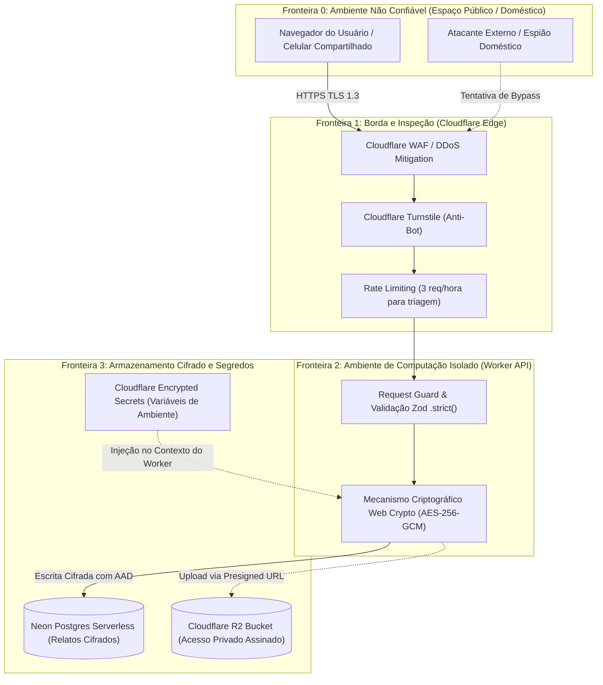

# Modelagem de Ameaças & AppSec Playbook (STRIDE & DREAD)

**Documento Canónico de Segurança de Aplicação (AppSec) e Engenharia de Proteção de Dados**  
**Versão:** 1.0.0  
**Classificação:** Análise de Risco e Controles Técnicos de Defesa  
**Metodologias:** STRIDE (Microsoft), DREAD (Risk Scoring) e OWASP ASVS v4.0.3

---

## 1. Contexto de Segurança e Ativos Críticos (*Crown Jewels*)

O ecossistema digital da **Pure Life Ministries Brasil** opera sob uma das superfícies de risco humano e moral mais sensíveis da tecnologia: a custódia de confissões de vida sexual, histórico de dependência de pornografia, infidelidade matrimonial e crises existenciais graves (Art. 11 da LGPD).

Os ativos de segurança primários (*Crown Jewels*) são:

1. **Relatos Confidenciais de Triagem:** Textos livres contendo confissões de pecado sexual e crises familiares.
2. **Chaves Mestras de Cifragem (DEK/KEK):** Segredos criptográficos residentes no Cloudflare Worker Secrets.
3. **Documentos Oficiais e Diplomas:** Arquivos submetidos por candidatos a cursos armazenados em buckets Cloudflare R2.
4. **Trilha Imutável de Auditoria (`LogAuditoriaAcesso`):** Histórico de quem consultou ou decifrou cada relato.
5. **Integridade das Doações e Webhooks Financeiros:** Webhooks do Asaas/Gateway e identificadores de transação Pix.

---

## 2. Diagrama de Fronteiras de Confiança (*Trust Boundaries*)



---

## 3. Matriz de Ameaças STRIDE e Controles Mitigatórios

A taxonomia **STRIDE** categoriza as ameaças potenciais contra o ecossistema, mapeando a técnica de ataque e a contramedida implementada na arquitetura:

| Categoria STRIDE | Vetor de Ameaça Identificado | Risco / Impacto | Mitigação Arquitetural Implementada |
|---|---|:---:|---|
| **Spoofing (Falsificação)** | Atacante forja webhook de confirmação de pagamento para liberar matrícula sem liquidação bancária. | **Alto** | Validação criptográfica de assinatura HMAC-SHA256 em tempo constante (`crypto.subtle.timingSafeEqual`) no Worker. |
| **Spoofing (Falsificação)** | Impersonação de conselheiro pastoral para obter acesso a formulários confidenciais. | **Crítico** | Autenticação multifator obrigatória (MFA), chaves de sessão com tempo de vida curto (JWT de 15 min) e revogação em 60s. |
| **Tampering (Adulteração)** | Ataque de recombinação de cifras (*Cross-Row Ciphertext Splicing*), transpondo o relato cifrado de um usuário para a linha de outro. | **Crítico** | Uso de **AES-256-GCM com AAD rígido**: o AAD concatena `triagem_id + ":" + column_name`. Se o ciphertext for movido, a autenticação GCM falha e a decifragem é abortada com erro. |
| **Tampering (Adulteração)** | Adulteração de arquivos de upload para pós-graduação inserindo web shells executáveis. | **Alto** | Verificação estrita de *Magic Bytes* (MIME type real), limite estrito de 5MB, renomeação por UUIDv7 aleatório e bloqueio de execução no bucket R2. |
| **Repudiation (Repúdio)** | Operador interno consulta prontuário íntimo e nega ter acessado os dados do aconselhado. | **Alto** | Tabela `LogAuditoriaAcesso` operando em modo estrito *Insert-Only* (sem permissão de `UPDATE` ou `DELETE` no banco). Toda decifragem gera log com IP, operador e timestamp. |
| **Information Disclosure (Vazamento)** | Confissão de triagem é armazenada em cache de CDN ou exposta nos logs de erro do Cloudflare Worker. | **Crítico** | Cabeçalho `Cache-Control: no-store, private, max-age=0` injetado na borda para todas as rotas sensíveis; sanitização de logs de aplicação mascarando qualquer parâmetro de entrada. |
| **Information Disclosure (Vazamento)** | Espionagem doméstica: familiar ou cônjuge abre o histórico do navegador e lê o relato do formulário. | **Crítico** | Zero persistência em `localStorage` ou `sessionStorage`. Limpeza imediata do estado React após submissão e destruição do formulário da memória volátil. |
| **Denial of Service (DoS)** | Script automatizado inunda a rota `/api/forms/triagem` esgotando o pool de conexões do Neon Postgres. | **Alto** | Cloudflare WAF, Turnstile managed challenge e rate limit restritivo de 3 requisições por hora por IP na borda antes de alcançar o Neon. |
| **Elevation of Privilege (Privilégios)** | Aluno de pós-graduação explora endpoint interno para visualizar triagens de acolhidos do Programa Residencial. | **Crítico** | Segregação estrita de roles RBAC no nível de middleware e banco. Usuários comuns não possuem credenciais de decifragem nem rotas no Worker para o domínio de triagem. |

---

## 4. Avaliação de Severidade DREAD

O modelo **DREAD** calcula a pontuação de risco para os cenários mais graves (escala de 1 a 10 por dimensão, onde Pontuação Final = $(D + R + E + A + D) / 5$):

| Cenário de Ameaça | Damage (Dano) | Reproducibility (Reprodutibilidade) | Exploitability (Explorabilidade) | Affected Users (Afetados) | Discoverability (Descoberta) | Score DREAD | Severidade |
|---|:---:|:---:|:---:|:---:|:---:|:---:|:---:|
| Vazamento de Triagem não Cifrada | 10 | 9 | 4 | 8 | 4 | **7.0** | **Alto** |
| Ataque de Transposição de Cifras (Mitigado por AAD) | 9 | 2 | 2 | 2 | 3 | **3.6** | **Baixo** |
| Forjamento de Webhook de Pagamento (Mitigado por HMAC) | 7 | 3 | 2 | 3 | 4 | **3.8** | **Baixo** |
| Espionagem em Cache de Borda (Mitigado por No-Store) | 9 | 2 | 3 | 4 | 3 | **4.2** | **Médio** |

---

## 5. Playbook de Resposta a Incidentes de Dados Sensíveis

Caso ocorra qualquer suspeita de exposição indevida de chaves de criptografia ou credenciais de banco:

```text
[FASE 1: CONTENÇÃO IMEDIATA (0 a 15 minutos)]
1. Acionar o Runbook de Rotação de Chaves (runbooks/key-rotation.md).
2. Atualizar TRIAGE_ENCRYPTION_KEY_V[N+1] no Cloudflare Worker via Wrangler Secrets.
3. Revogar tokens de sessão ativos e alterar a senha de conexão do Neon Postgres.

[FASE 2: INVESTIGAÇÃO FORENSE (15 a 60 minutos)]
1. Executar consulta na tabela LogAuditoriaAcesso para isolar registros lidos no intervalo do incidente.
2. Identificar endereços IP de origem e assinaturas de User-Agent anômalas.

[FASE 3: NOTIFICAÇÃO E GOVERNANÇA (até 48 horas)]
1. Comunicação formal ao Encarregado de Proteção de Dados (DPO).
2. Avaliação de impacto à luz do Art. 48 da LGPD para comunicação à ANPD e aos titulares afetados.
```
